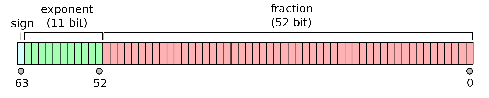
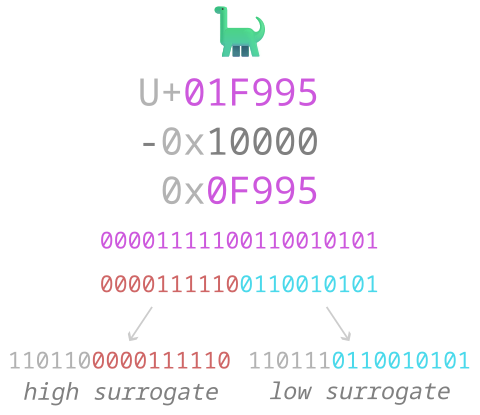

| 구분 | 데이터 타입 | 설명 |
| --- | --- | --- |
| 원시 타입 | 숫자 타입 | 숫자. 정수와 실수 구분 없이 하나의 숫자 타입만 존재 |
|  | 문자열 타입 | 문자열 |
|  | 불리언 타입 | 논리적 참(true)과 거짓(false) |
|  | undefined 타입 | var 키워드로 선언된 변수에 암묵적으로 할당되는 값 |
|  | null 타입 | 값이 없다는 것을 의도적으로 명시할 때 사용하는 값 |
|  | 심벌 타입 | ES6에서 추가된 7번째 타입 |
| 객체 타입 |  | 객체, 함수, 배열 등 |

## 숫자타입

- 배정밀도 64비트 부동 소수점 형식의 실수

[2.1 부동 소수점](https://wikidocs.net/225097)

- 정수로 표기해도 자바스크립트 엔진은 실수로 처리함

```jsx
console.log(1 === 1.0); // true
```

---

## 문자열 타입

- 0개 이상의 16비트 유니코드(UTF-16) 의 집합

---

## null 타입

- 변수에 값이 없다는 것을 의도적으로 명시(의도적 부재) 할 때 사용
- 변수에 null을 할당한다는 것은 이전에 참조하던 값을 더이상 참조하지 않겠다는 의미
    - 따라서 변수를 null로 초기화 하는 것은 어색하다

---

## symbol 타입

- 변경 불가능한 원시 타입의 값
- 다른 값과 중복되지 않는 유일무이한 값
- 보통 객체의 유일한 프로퍼티 키를 만들 때 사용한다

---

## 데이터 타입의 필요성

- 데이터 타입에 따라 얼마나 메모리 공간을 확보하고 어떻게 참조할지 결정하기 때문
- 반대로 메모리에 저장된 2진수 값을 어떻게 해석해야할지 결정하기 위해
    - 예를들어 `0100 0001` 은 숫자 65가 될 수도 있지만 문자 타입으로 해석하면 ‘A’로 해석할 수 있다. 같은 2진수 값이지만 데이터 타입에 따라 다르게 해석

---

## 동적 타입 언어

- 자바스크립트는 컴파일 시점에 타입 체크를 수행하는 언어로 동적 타입언어이다.
    - 선언 시에 타입을 결정하는 C와  JAVA 같은 정적 타입 언어와 대비된다.
- 변수에 할당된 리터럴을 통해 컴파일 시점에 값의 타입을 결정한다. (타입추론)

<aside>
💡 따라서 선언 시에 타입이 결정되는 언어를 정적 타입 언어. 
할당 시에 타입이 결정되는 언어를 동적 타입 언어로 구분할 수도 있다.

</aside>

- `typeof` 예약어를 통해 특정 변수에 할당된 값의 타입을 확인할 수 있다.