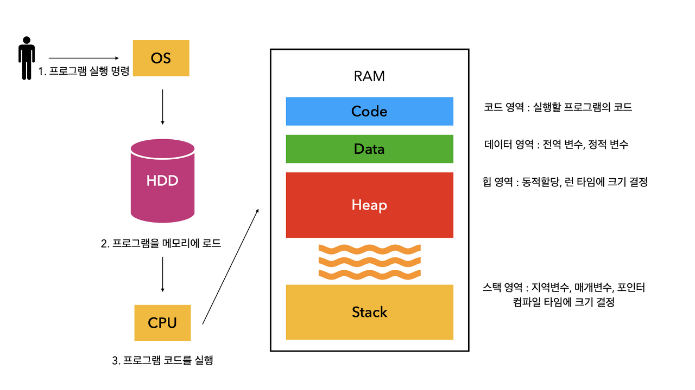
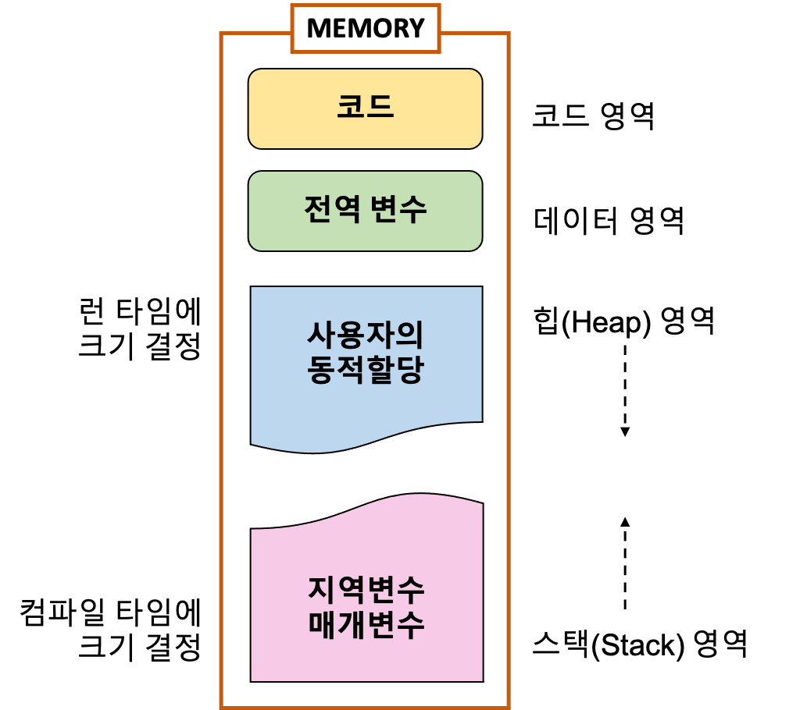
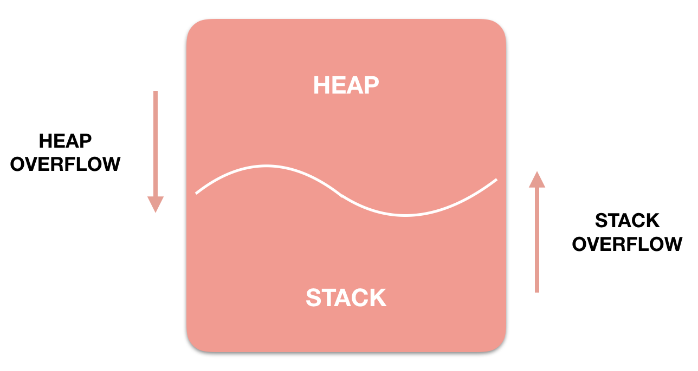

## 변수와 메모리 할당

앞선 챕터에서 변수는 메모리에 공간을 할당받고 그 공간의 주소를 가지고 있는 식별자라는걸 알았다.
동시에 우리는 값의 타입에 따라 메모리 공간의 크기가 다르다는 사실도 알았다. 그렇다면 초기화가 아닌 선언만 한 변수의 메모리 공간의 크기는 어떻게 되는걸까? 그리고 거기에 값을 할당하면 메모리 공간의 크기도 증가하는걸까?

1. **변수 선언만 했을 때 (초기화 없이)**

```tsx
let a;
var b;
```

- 선언만 하는 경우 암묵적으로 해당 변수에는 `undefined` 가 할당된다.
- `undefined` 타입은 4~8 바이트의 고정 크기 메모리 공간을 확보하는 값이다.
    - 즉 a,b 변수가 참조하는 메모리 주소의 메모리 공간의 크기는 4~8바이트(32~64bit)
    - 32bit OS에서는 4바이트, 64bit OS에서는 8바이트일 확률 높음

1. **값 재할당**

```jsx
let value; // 초기에 undefined로 설정되고 기본 메모리 할당
value = 42; // 숫자 타입으로 변경, 메모리 재할당
value = "Hello"; // 문자열 타입으로 변경, 더 많은 메모리 필요하므로 재할당
```

- 값을 재할당하면서 **다시 메모리도 재할당**한다.

| 값 타입 | 크기 (bit) |
| --- | --- |
| undefined | 32 ~ 64 |
| null  | 32 ~ 64 |
| boolean | 8 ~ 32 |
| Number | 64 (배정밀도 부동소수점) |
| BigInt | 가변크기 |
| 문자열 | 가변크기 |
| 심볼 | 내부 구현에 따라 다름 |

## 원시값

원시 값(원시 타입 값)을 변수에 할당하면 변수에는 (확보된 메모리 공간)에는 **실제 값**이 저장된다.
(이와 달리 객체는 변수에 할당하면 메모리에 **참조 값**이 저장된다.)

이러한 차이는 변수를 변수에 할당할 때도 보이는데

원시값의 경우 **원시 값이 복사되어 새로운 변수(메모리 공간)에 저장**된다. 이를 **값에 의한 전달(pass by value)**이라고 한다.

객체값의 경우에는 **참조 값이 복사되어 새로운 변수(메모리 공간)에 저장**된다. 이를 **참조에 의한 전달(pass by reference)**라고 한다.

### 변경 불가능한 값, Immutable value

원시 값은 변경이 불가능한 읽기전용 값이다. 일반적으로 우리가 값을 다룰 때는 변수를 이용해서 다룬다.
값은 불변하나 변수는 변경할 수 있다. 대부분의 경우 우리가 원시값을 수정한다고 생각하는 동작들은 원시 값을 수정하는 것이 아닌 변수를 수정하는 동작이다. 따라서 아래와 같은 특징을 가진다. (원시값 기준)

- **변수에 새로운 값을 할당하는 경우(재할당)**
    - 메모리에 저장된 값은 수정할 수 없다.
    - 기존 변수가 확보한 메모리 공간은 이제 무시한다.
    - 새로운 메모리 공간을 확보하고 원시값을 저장한다.
    - 새롭게 확보한 메모리 공간의 주소를 기존 변수가 재참조한다.
        - 참조가 끊긴 예전 메모리 공간은 가비지 컬렉터가 정리한다.
- **변수에 변수를 할당하는 경우**
    - 메모리에 저장된 값은 수정할 수 없다.
    - 새로운 변수의 메모리 공간을 확보한다.
    - 기존 변수의 메모리 공간에 있는 원시값을 복사한다.
    - 새로 확보한 변수의 메모리 공간에 복사한 원시값을 할당한다.
    - 두 변수의 값은 같으나 메모리 주소는 다르기 때문에 두 변수는 동등할 뿐 동일하지 않다.

## 객체

객체는 원시값과 다르게 동적으로 값이(프로퍼티) 추가될 수 있다. 따라서 원시값과 달리 확보해야할 메모리 공간의 크기도 사전에 정해둘 수 없다.

그렇기에 객체는 원시값과 달리 동적으로 크기를 할당받을 수 있는(가변크기) 메모리 영역을 할당받는다. 이 메모리 영역을 heap이라고 부른다.

### 객체의 메모리 할당 과정

**초기 메모리 할당**

객체가 처음 생성될 때 자바스크립트 엔진은 다음과 같은 과정을 거침

```jsx
let person = {}; // 빈 객체 생성
```

- **기본 구조 할당**: 엔진은 객체의 기본 구조를 위한 메모리를 할당
  이 기본 구조에는 내부 속성(히든 클래스 참조, 프로토타입 참조 등)을 저장할 공간이 포함됩니다.
- **초기 속성 저장 공간 할당**: 객체 리터럴에 포함된 초기 속성을 위한 공간을 할당

  예를 들어, 아래와 같은 속성을 가진 객체를 생성하면..

    ```jsx
    let person = { name: "Kim", age: 30, city: "Seoul" };
    ```

    - **객체 헤더**: ~16-24바이트 (64비트 시스템 기준)
        - 타입 정보, 히든 클래스 참조 등
    - **인라인 속성 공간**:
        - name: 8바이트 (문자열에 대한 포인터)
        - age: 8바이트 (SMI(Small Integer)로 저장되더라도 슬롯 크기는 동일)
        - city: 8바이트 (문자열에 대한 포인터)
    - **여분 공간**: 1-2개 추가 속성을 위한 공간

  총 약 64~96 바이트 할당 (V8 엔진 기준)


### 속성 추가 시 메모리 관리

```jsx
person.email = "kim@example.com"; // 새 속성 추가
```

1. **속성 공간 확장**: 기존 메모리 블록에 충분한 여유 공간이 있다면 그 공간을 사용하여 새 속성을 저장
2. **메모리 재할당**: 기존 메모리 블록에 충분한 공간이 없으면 더 큰 메모리 블록을 새로 할당하고 기존 데이터를 복사한 후 새 속성을 추가


- 프로그램이 실행되면 운영체제는 프로세스에 일정 크기의 메모리를 할당함(리소스 부여)
    - 해당 메모리는 논리적으로 코드, 스택, 힙 등 여러 세그먼트로 나뉘어져있음
- 자바스크립트 엔진은 컴파일 시에 원시값들을 계산하여 스택 영역의 크기를 결정함
- 자바스크립트 엔진은 시작 시에 heap 영역을 4~8MB로 초기 할당함
    - heap 영역이 가득차면 엔진은 운영체제에게 더 많은 메모리를 요청함
    - 이 때 요청하는 메모리는 프로세스 실행 시에 할당 받은 가상메모리 범위 내에서 요청하게 됨
  

Heap 영역과 Stack 영역은 사실 **같은 공간을 공유**한다. Heap이 메모리 위쪽 주소부터 할당되면 Stack은 아래쪽부터 할당되는 식이다. 그래서 각 영역이 **상대 공간을 침범하는 일이 발생**할 수 있는데, 이를 각각 **Heap Overflow, Stack Overflow** 라고 칭한다. 따라서 Stack 영역이 클수록 Heap 영역이 작아지고, Heap 영역이 크면 Stack 영역이 작아진다.

### 히든 클래스(Hidden Classes) 메커니즘

C++ 이나 자바는 사전에 미리 정의된 클래스를 이용해 인스턴스를 생성하기 때문에 프로퍼티와 메서드가 정해져있음. 따라서 이러한 언어는 프로퍼티에 접근할 때 컴파일 시점에 계산된 메모리 오프셋을 사용해서 효율적으로 접근함.

그러나 자바스크립트는 동적으로 프로퍼티의 갯수를 조절할 수 있는 특징이 있음. 초기 자바스크립트는 이러한 동적 특성을 지원하기 위해 해시테이블과 유사한 dictionary 구조를 사용함. 그러나 이 방식은 오버헤드가 많아서 비효율적.  V8과 같은 현대적인 자바스크립트 엔진은 이러한 비용을 최적화 하기위해 히든 클래스'라는 개념을 사용함

[제멋대로 JS 객체 프로퍼티를 읽어내는 법(feat.V8 Hidden Class)](https://velog.io/@sosoyim/%EC%A0%9C%EB%A9%8B%EB%8C%80%EB%A1%9C-JS-%EA%B0%9D%EC%B2%B4-%ED%94%84%EB%A1%9C%ED%8D%BC%ED%8B%B0%EB%A5%BC-%EC%9D%BD%EC%96%B4%EB%82%B4%EB%8A%94-%EB%B2%95feat.V8-Hidden-Class)