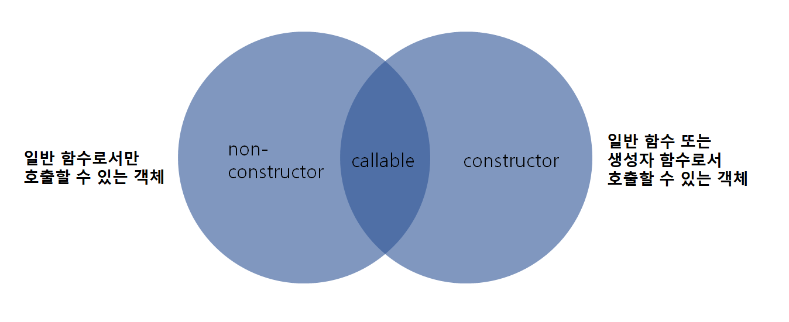

## 객체 생성하는 다양한 방법

| 생성 방법 | 문법 | 설명 | 특징 | 예시 |
| --- | --- | --- | --- | --- |
| 객체 리터럴 | `{}` | 중괄호를 사용하여 직접 객체를 생성 | 가장 간단하고 일반적인 방법 | `const person = { name: '홍길동', age: 30 };` |
| 생성자 함수 | `new Constructor()` | 함수를 사용하여 객체 템플릿 정의 | 여러 유사한 객체를 만들 때 유용 | `function Person(name, age) { this.name = name; this.age = age; } const person = new Person('홍길동', 30);` |
| Object 생성자 | `new Object()` | Object 내장 생성자 사용 | 리터럴보다 덜 사용됨 | `const person = new Object(); person.name = '홍길동'; person.age = 30;` |
| Object.create() | `Object.create(proto)` | 지정된 프로토타입 객체와 속성을 갖는 새 객체 생성 | 프로토타입 상속을 명시적으로 지정 | `const personProto = { greet() { return` 안녕하세요, ${this.name}입니다`; } }; const person = Object.create(personProto); person.name = '홍길동';` |
| 클래스 (ES6+) | `class ... {}` | 클래스 문법으로 객체 템플릿 정의 | 생성자 함수의 문법적 설탕, OOP 스타일 | `class Person { constructor(name, age) { this.name = name; this.age = age; } greet() { return` 안녕하세요, ${this.name}입니다`; } } const person = new Person('홍길동', 30);` |
| 팩토리 함수 | `factory()` | 객체를 반환하는 일반 함수 | new 키워드 없이 객체 생성 가능 | `function createPerson(name, age) { return { name, age, greet() { return` 안녕하세요, ${name}입니다`; } }; } const person = createPerson('홍길동', 30);` |
| Object.assign() | `Object.assign({}, obj)` | 하나 이상의 원본 객체에서 대상 객체로 속성 복사 | 객체 복제나 합성에 유용 | `const defaults = { age: 0, gender: '미지정' }; const person = Object.assign({}, defaults, { name: '홍길동', age: 30 });` |
| 객체 분해 할당 (ES6+) | `{...obj}` | 스프레드 연산자를 사용하여 객체 속성 복사 | 간결한 구문으로 객체 복제 | `const defaults = { age: 0, gender: '미지정' }; const person = { ...defaults, name: '홍길동', age: 30 };` |
| Map 객체 (ES6+) | `new Map()` | 키-값 쌍을 저장하는 컬렉션 | 키가 문자열이 아닌 값도 가능 | `const person = new Map(); person.set('name', '홍길동'); person.set('age', 30);` |
| Proxy (ES6+) | `new Proxy(obj, handler)` | 객체의 기본 동작을 사용자 정의 | 객체 작업 중재 및 가로채기 가능 | `const person = new Proxy({ name: '홍길동' }, { get(obj, prop) { return prop in obj ? obj[prop] : '속성이 없습니다'; } });` |

## 객체 리터럴 방식

- 단일 객체 만들 때 가장 간편하게 생성할 수 있음
- 객체 리터럴은 중괄호(`{}`)를 사용하여 객체를 직접 생성합니다.
  중괄호 안에 속성과 값을 쉼표로 구분하여 정의합니다.

    ```jsx
    const person = {
        name: '홍길동',
        age: 30,
        job: '개발자'
    };
    ```


- **객체 리터럴의 중첩(Nesting)**
  객체 리터럴 내에 다른 객체를 중첩하여 복잡한 데이터 구조를 표현할 수 있습니다

    ```jsx
    const student = {
        name: '홍길동',
        age: 20,
        grades: {
            math: 95,
            science: 88,
            language: 92
        },
        address: {
            city: '서울',
            district: '강남구',
            details: {
                street: '테헤란로',
                building: '123동'
            }
        }
    };
    
    // 중첩된 속성에 접근
    console.log(student.grades.math);  // 95
    console.log(student.address.details.street);  // '테헤란로'
    ```

    - 이 때 객체안에 중첩된 객체들도 독립적인 객체로서 존재

## 생성자 함수

- 생성자 함수는 구문적으로는 일반 함수와 동일
    - 다만 호출 할 때 `new` 키워드를 통해 함수를 호출하면 새로운객체를 생성하고 초기화함
    - `new` 키워드만 붙이면 일반 함수도 생성자 함수처럼 무조건 호출할 수 있는거임?

      기술적으로는 자바스크립트에서 모든 함수는 `new` 키워드와 함께 호출할 수 있어 생성자처럼 사용할 수 있음. 하지만 이게 좋거나 의도된건 아니기 때문에 구별을 위한 몇가지 방법들을 사용함

      ### **1. 명명 규칙 (컨벤션)**

        - 생성자 함수: 파스칼 케이스(PascalCase)로 첫 글자를 대문자로 씁니다 (예: `Person`, `Product`)
        - 일반 함수: 카멜 케이스(camelCase)로 첫 글자를 소문자로 씁니다 (예: `calculateTax`, `getUserData`)
        - 규칙에 의해 판단하는거라 당연히 휴먼에러날 확률 많음!

      ### 2. 내부 설계와 this 바인딩

      생성자 함수는 일반적으로 `this` 키워드를 사용하여 새로 생성될 객체의 속성을 초기화하도록 설계되어 있습니다:

        ```jsx
        // 생성자 함수 - this를 사용하여 객체 속성 설정
        function Car(make, model) {
          this.make = make;
          this.model = model;
          this.isRunning = false;
        }
        
        // 일반 함수 - 객체를 반환하거나 다른 작업 수행
        function createCar(make, model) {
          return {
            make: make,
            model: model,
            isRunning: false
          };
        }
        ```

      **생성자 함수는 보통 아무것도 명시적으로 반환하지 않습니다**. 대신 `this`가 암묵적으로 반환됩니다. 일반 함수는 보통 값을 계산하거나 명시적으로 객체를 반환합니다.

      ### **3. 함수가 반환하는 값**

      생성자 함수와 일반 함수는 반환 값 처리에서도 차이가 있습니다:

        ```jsx
        // 생성자 함수 - **객체를 반환하면 this 대신 그 객체가 반환됨**
        function StrangeCtor() {
          this.prop = 1;
          return { differentProp: 2 }; // 이 객체가 반환됨
        }
        
        // 생성자 함수 - **원시값을 반환하면 무시되고 this가 반환됨**
        function NormalCtor() {
          this.prop = 1;
          return 42; // 무시됨, this가 반환됨
        }
        
        const strange = new StrangeCtor();
        console.log(strange.prop); // undefined
        console.log(strange.differentProp); // 2
        
        const normal = new NormalCtor();
        console.log(normal.prop); // 1
        ```

      생성자 함수에서 객체를 명시적으로 반환하면 `this` 대신 그 객체가 반환되고, 원시값을 반환하면 무시되고 `this`가 반환됩니다.

      ## **일반 함수를 생성자로 호출하는 경우의 문제점**

      일반 함수를 `new`와 함께 호출하면 예상치 못한 동작이 발생할 수 있습니다:

        ```jsx
        function add(a, b) {
          return a + b;
        }
        
        const result = new add(3, 5);
        console.log(result); // add {}
        console.log(result instanceof add); // true
        console.log(result.constructor === add); // true
        
        ```

      위 예제에서 `new add(3, 5)`는 빈 객체를 생성하고 `add` 함수의 `prototype`과 연결합니다. 하지만 `add` 함수는 `this`를 사용하여 속성을 추가하지 않으며, 함수가 반환하는 값은 숫자(원시값)이므로 무시됩니다. 결과적으로 빈 객체가 반환됩니다.

      ## **생성자 함수를 일반 함수로 호출하는 경우의 문제점**

      생성자 함수를 `new` 없이 호출하면 더 심각한 문제가 발생할 수 있습니다:

        ```jsx
        function Person(name) {
          this.name = name;
        }
        
        // new 없이 호출
        const person = Person('홍길동');
        console.log(person); // undefined (함수가 명시적으로 반환하는 값이 없음)
        console.log(name); // '홍길동' (전역 객체에 name 속성이 추가됨)
        
        ```

      `new` 없이 호출되면 `this`는 전역 객체(브라우저에서는 `window`, Node.js에서는 `global`)를 가리킵니다. 따라서 `Person('홍길동')`은 전역 객체에 `name` 속성을 추가하는 결과를 가져옵니다. 이는 의도하지 않은 전역 변수 오염을 일으킬 수 있습니다.

      ## **생성자 함수의 안전한 구현**

      이러한 문제를 방지하기 위해 생성자 함수는 다음과 같이 구현할 수 있습니다:

        ```jsx
        // Scope-safe Constructor 패턴
        // ES6 이전에 많이 사용되던
        function SafePerson(name) {
          // new 없이 호출된 경우 new와 함께 다시 호출
          **if (!(this instanceof SafePerson)) {
            return new SafePerson(name);
          }**
        
          this.name = name;
        }
        
        // new 없이 호출해도 안전함
        const person1 = SafePerson('홍길동');
        console.log(person1.name); // '홍길동'
        
        // 일반적인 new 호출도 정상 작동
        const person2 = new SafePerson('김철수');
        console.log(person2.name); // '김철수'
        ```

      혹은 `new.target` 을 통해서도 가능하다

        ```tsx
        function SafePerson(name) {
          // new.target이 undefined이면 new 없이 호출된 것
          if (!new.target) {
            return new SafePerson(name);
          }
          
          this.name = name;
        }
        
        // new 없이 호출해도 안전함
        const person1 = SafePerson('홍길동');
        console.log(person1.name); // '홍길동'
        
        // 일반적인 new 호출도 정상 작동
        const person2 = new SafePerson('김철수');
        console.log(person2.name); // '김철수'
        ```

      `new.target`은 ES6에서 도입된 메타 프로퍼티로, 함수가 `new` 연산자와 함께 호출되었는지를 확인하는 더 현대적인 방법입니다.

      `new.target`의 장점은 다음과 같습니다:

        1. **더 명확한 의도 표현**: `new.target`은 명시적으로 함수가 생성자로 호출되었는지 확인하기 위한 목적으로 설계되었습니다.
        2. **상속 관계에서 더 정확한 동작**: 상속 관계에서 `this instanceof Constructor` 체크는 때로 예상치 못한 결과를 낼 수 있지만, `new.target`은 항상 현재 호출된 생성자를 정확히 가리킵니다.
        3. **클래스 내부에서도 사용 가능**: `new.target`은 ES6 클래스의 생성자 내부에서도 사용할 수 있습니다.

      ## **ES6 클래스와의 비교**

      ES6에서 도입된 클래스는 이러한 혼란을 줄이기 위한 방법 중 하나입니다:

        ```jsx
        class Person {
          constructor(name) {
            this.name = name;
          }
        }
        
        // 클래스는 반드시 new와 함께 호출해야 함
        // const person = Person('홍길동'); 
        // TypeError: Class constructor Person cannot be invoked without 'new'
        const person = new Person('홍길동'); // 정상 작동
        
        ```

      **클래스 생성자는 `new` 없이 호출할 수 없으므로, 이 문제를 원천적으로 방지합니다.**


```tsx
// 생성자 함수 정의
function Person(name, age) {
  this.name = name;
  this.age = age;
  this.greet = function() {
    return `안녕하세요, ${this.name}입니다!`;
  };
}

// 생성자 함수를 사용한 객체 생성
const person1 = new Person('홍길동', 30);
const person2 = new Person('김철수', 25);

console.log(person1.name); // '홍길동'
console.log(person2.greet()); // '안녕하세요, 김철수입니다!'
```

### 생성자 함수 작동 원리

생성자 함수가 `new` 키워드와 함께 호출될 때 내부적으로 일어나는 일은 다음과 같습니다.

1. 새로운 빈 객체가 생성됩니다.
2. **이 객체의 `[[Prototype]]`(또는 `__proto__`)이 생성자 함수의 `prototype` 속성과 연결됩니다.**
3. **함수 내부의 `this`가 새로 생성된 객체를 가리키도록 설정**됩니다.
4. 함수 본문의 코드가 실행되어 `this`를 통해 객체에 속성과 메서드를 추가합니다.
5. 함수가 명시적으로 다른 객체를 반환하지 않는 한, `this`에 바인딩된 새 객체가 반환됩니다.
    1. 이 때 명시적으로 원시값을 반환하는 경우에는 무시되고 this가 반환됨

```tsx
function new(Constructor, ...args) {
  // 1. 새로운 빈 객체 생성
  const obj = {};
  
  // 2. 객체의 프로토타입 설정
  Object.setPrototypeOf(obj, Constructor.prototype);
  
  // 3 & 4. 생성자 함수 실행, this를 새 객체에 바인딩
  const result = Constructor.apply(obj, args);
  
  // 5. 생성자의 반환값이 객체면 그 객체를, 아니면 새 객체 반환
  return (typeof result === 'object' && result !== null) ? result : obj;
}
```

### 생성자 함수 네이밍 컨벤션

생성자 함수는 일반 함수와 구분하기 위해 첫 글자를 대문자로 작성하는 파스칼 케이스(PascalCase) 네이밍 컨벤션을 따름

```jsx
// 일반 함수 - 카멜 케이스
function calculateArea(radius) {
  return Math.PI * radius * radius;
}

// 생성자 함수 - 파스칼 케이스
function Circle(radius) {
  this.radius = radius;
  this.getArea = function() {
    return Math.PI * this.radius * this.radius;
  };
}
```

### 프로토타입과 생성자 함수

생성자 함수로 객체를 생성할 때 주의할 점은 모든 인스턴스마다 메서드가 중복 생성된다는 것입니다. 이는 메모리 효율성을 저하시킬 수 있습니다:

```jsx
function Person(name) {
  this.name = name;
  // 각 인스턴스마다 동일한 함수가 메모리에 중복 생성됨
  this.greet = function() {
    return `안녕하세요, ${this.name}입니다!`;
  };
}

const p1 = new Person('홍길동');
const p2 = new Person('김철수');

console.log(p1.greet === p2.greet); // false (다른 함수 객체)
```

이 문제를 해결하기 위해 프로토타입을 활용합니다.
프로토타입에 메서드를 정의하면 모든 인스턴스가 이를 공유하므로 메모리 효율성이 향상됩니다

```jsx
function Person(name) {
  this.name = name;
  // 인스턴스 속성만 여기에 정의
}

// 프로토타입에 메서드 정의 (모든 인스턴스가 공유)
Person.prototype.greet = function() {
  return `안녕하세요, ${this.name}입니다!`;
};

const p1 = new Person('홍길동');
const p2 = new Person('김철수');

console.log(p1.greet === p2.greet); // true (같은 함수 객체 참조)
```

프로토타입은 다음 챕터에서 더 상세히 설명

### 생성자 함수의 장단점

장점:

1. 동일한 구조의 객체를 여러 개 생성할 때 코드 중복을 줄일 수 있습니다.
2. 프로토타입을 통해 메서드를 공유하여 메모리 효율성을 높일 수 있습니다.
3. 객체가 어떤 생성자로부터 만들어졌는지 쉽게 확인할 수 있습니다(`instanceof`).
4. ES6 이전의 자바스크립트에서 객체 지향 프로그래밍의 기본 패턴이었습니다.

단점:

1. 프로토타입 상속 구현이 직관적이지 않을 수 있습니다.
2. `new` 키워드를 잊어버리면 예상치 못한 버그가 발생할 수 있습니다.
3. ES6 클래스에 비해 문법이 덜 명확할 수 있습니다.
4. 프라이빗 속성(private properties)을 기본적으로 지원하지 않습니다.

생성자 함수는 ES6 클래스가 도입되기 전에 자바스크립트에서 객체 지향 프로그래밍을 구현하는 주요 방법이었습니다. 오늘날에도 많은 레거시 코드에서 이 패턴을 볼 수 있으며, 자바스크립트의 프로토타입 기반 상속을 이해하는 데 중요한 개념입니다. ES6 클래스가 보다 현대적인 문법을 제공하지만, 내부적으로는 여전히 프로토타입 기반의 생성자 함수 메커니즘을 사용합니다.

## 함수와 객체의 차이 그리고 내부슬릇

- 함수는 객체이지만 일반 객체와 다르다.
- **일반 객체는 호출할 수 없지만(call) 함수는 호출할 수 있다.**
- 그래서 함수는 일반 객체와 달리 호출을 위한 추가적인 내부슬릇을 가지고 있다.

### 함수 객체의 내부 슬롯 (Internal Slots)

| 내부 슬롯 | 설명 | 역할 |
| --- | --- | --- |
| `[[Call]]` | 함수 호출 시 실행되는 내부 메서드 | 함수가 **일반 함수로서 호출될 때** (`func()` 형태) 실행되는 알고리즘을 정의 |
| `[[Construct]]` | 생성자 호출 시 실행되는 내부 메서드 | 함수가 **생성자 함수로서 호출될 때** (`new func()` 형태) 실행되는 알고리즘을 정의 |
| `[[Environment]]` | 함수의 렉시컬 환경을 참조 | 함수가 정의된 환경(스코프)을 기억하여 클로저를 구현 |
| `[[FormalParameters]]` | 함수의 매개변수 목록 저장 | 함수 호출 시 인수와 매개변수를 매핑하는 데 사용 |
| `[[ECMAScriptCode]]` | 함수의 실행 코드 저장 | 함수 호출 시 실행될 코드를 보관 |
| `[[ScriptOrModule]]` | 함수가 정의된 스크립트나 모듈 참조 | 함수의 출처와 모듈 관련 정보를 관리 |
| `[[Realm]]` | 함수가 속한 실행 환경 정보 | 전역 객체 등 함수 실행에 필요한 환경 정보 관리 |
| `[[HomeObject]]` | 메서드가 정의된 객체 참조 (ES6+) | `super` 키워드 동작에 필요한 정보 제공 |
| `[[IsClassConstructor]]` | 클래스 생성자 여부 (ES6+) | 클래스 생성자의 `new` 없는 호출 방지 |
| `[[InitialName]]` | 함수의 원래 이름 (디버깅용) | 개발 도구에서 함수 식별에 도움 |

### 일반 객체와 함수 객체의 공통 내부 슬롯

| 내부 슬롯 | 설명 |
| --- | --- |
| `[[Prototype]]` | 프로토타입 객체에 대한 참조 (상속) |
| `[[Extensible]]` | 객체의 확장 가능 여부 |
| `[[OwnPropertyKeys]]` | 객체 자신의 모든 프로퍼티 키 목록 |

### 함수 객체의 접근 가능한 특별 프로퍼티

| 프로퍼티 | 설명 | 예시 |
| --- | --- | --- |
| `name` | 함수의 이름 | `function foo() {}; console.log(foo.name); // "foo"` |
| `length` | 함수 **매개변수의 수** | `function(a, b, c) {}; // length는 3` |
| `prototype` | 생성자 함수가 생성하는 객체의 프로토타입 | `MyConstructor.prototype.method = function() {};` |
| `arguments` | 함수 내부에서 사용 가능한 전달된 인수들 | `function f() { console.log(arguments); }` |
| `caller` | 함수를 호출한 함수 (비표준) | `function inner() { console.log(inner.caller); }` |
- 어떠 함수가 일반 호출될 때는 `[[Call]]`  생성자 함수로 호출될 때는 `[[Constructor]]` 가 실행된다.

```tsx
function foo() {}

// [[Call]이 호출
foo();

// [[Constructor]]
new foo();
```

- 이 때 내부 메서드 `[[Call]]` 을 가지는 함수객체를 **callable** 이라고 한다.
- 내부 메서드 `[[Constructor]]` 을 갖는 함수 객체를 **constructor** 라고 부른다.
- 내부 메서드 `[[Constructor]]` 을 갖지않는 함수 객체를 **non-constructor** 라고 부른다.

근데 이거 맞는 그림이 아닌거 같은데 객체가 가지고 있는 내부메서드로 그린건가?

```
    ┌─────────────────────────────┐
    │    함수 객체 (모두 Callable)    │
    │                             │
    │  ┌───────────────┐          │
    │  │ Constructor   │          │
    │  │    함수       │          │
    │  └───────────────┘          │
    │                             │
    │  ───────── Non-────────────  │
    │       Constructor 함수      │
    └─────────────────────────────┘

```

- 호출할 수 없는 객체는 함수 객체가 아니므로 모든 함수는 반드시 callable 이어야한다.
    - 따라서 모든 함수 객체는 내부 메서드 `[[Call]]` 을 가지고 있고 호출할 수 있다.
      (의도와는 별개로)
- 그러나 모든 함수 객체가 `[[Constructor]]` 을 가지는건 아니다.
    - 따라서 함수 객체는 constructor 일 수도 있고 non-constructor 일 수 있다.
- 결론적으로 모든 함수 객체는 callable 이면서 constructor 이거나 callable 이면서 non-constructor다.

Constructor(생성자) 함수와 Non-constructor(비생성자) 함수 비교

| 구분 | Constructor(생성자) | Non-constructor(비생성자) |
| --- | --- | --- |
| **정의** | `new` 연산자와 함께 호출하여 객체를 생성할 수 있는 함수 | `new` 연산자와 함께 호출할 수 없는 함수 |
| **내부 슬롯** | `[[Construct]]` 내부 슬롯 보유 | `[[Construct]]` 내부 슬롯 미보유 |
| **호출 방식** | **일반 함수로도 호출 가능, 생성자 함수로도 호출 가능** | 오직 일반 함수로만 호출 가능 |

## constructor 와 non-constructor

자바스크립트에서 함수는 `constructor`(생성자)와 `non-constructor`(비생성자)로 구분할 수 있습니다. 이 구분은 함수가 `new` 연산자와 함께 생성자로서 호출될 수 있는지 여부에 관한 것입니다.

### Constructor(생성자) 함수 종류

| 함수 유형 | 설명 | 예시 |
| --- | --- | --- |
| 함수 선언문 | `function` 키워드로 선언된 일반 함수 | `function Foo() {}` |
| 함수 표현식 | 변수에 할당된 익명 함수 | `const Foo = function() {};` |
| 생성자 함수 | 명시적으로 객체 생성을 위해 설계된 함수 | `function Person(name) { this.name = name; }` |
| 클래스 선언문 | ES6에서 도입된 클래스 문법으로 선언된 함수 | `class Person {}` |
| 클래스 표현식 | 변수에 할당된 클래스 | `const Person = class {};` |
| Function 생성자 | `new Function()`으로 생성된 함수 | `const add = new Function('a', 'b', 'return a + b');` |

### Non-constructor(비생성자) 함수 종류

| 함수 유형 | 설명 | 예시 |
| --- | --- | --- |
| 화살표 함수 | ES6에서 도입된 `=>` 문법의 함수 | `const add = (a, b) => a + b;` |
| 메서드 축약 표현 | ES6에서 도입된 객체 리터럴 내 메서드 축약형 | `const obj = { method() { } };` |
| 클래스 내부 메서드 | 클래스 내부에 정의된 메서드 | `class Person { speak() { } }` |
| 제너레이터 함수 | `function*` 문법으로 정의된 함수 | `function* gen() { yield 1; }` |

**Constructor와 Non-constructor 식별 방법**

```jsx
function isConstructor(fn) {
  try {
    new fn();
    return true;
  } catch (error) {
    return false;
  }
}

// 테스트 예시
function regularFunction() {}
const arrowFunction = () => {};
const methodObj = { method() {} };

console.log(isConstructor(regularFunction)); // true
console.log(isConstructor(arrowFunction)); // false
console.log(isConstructor(methodObj.method)); // false
```

### Constructor 함수 호출 시 내부 동작

1. 빈 객체 생성 및 this 바인딩
2. 객체의 프로토타입 설정
3. this를 통한 프로퍼티 추가
4. 생성된 객체 반환

### Non-constructor 함수에 new 연산자 사용 시

- TypeError: [함수명] is not a constructor 에러 발생

### 헷갈리는 메서드의 차이점

- 위에서 보았듯 메서드의 경우에는 non-constructor다
- 그러나 메서드로 인정되는건 메서드 축약 표현만 메서드로 인정된다.

```tsx
// 일반 함수 정의 : 함수 선언문, 함수 표현식
function foo() {}
const bar = function() {};

// 프로퍼티 x의 값으로 할당된 것은 일반 함수로 정의된 함수이다. 
// 이는 메서드로 인정하지 않는다.
const baz = {
	x: function () {}
}

// 일반 함수로 정의된 함수만이 constructor다.
new foo(); // -> foo {}
new bar(); // -> bar {}
**new baz.x(); // -> x {}**

// 화살표 함수나 축약 표현된 메서드는 non-constructor 다.
const arrow = () => {};
new arrow(); // TypeError: arrow is not a constructor

// 메서드 정의: ES6의 메서드 축약 표현만 메서드로 인정한다.
const obj = {
	x() {}
	y: function () {}
};

new obj.x(); // TypeError: obj.x is not a constructor
new baz.y(); // -> y {}
```

- 그럼 메서드란 뭐지?

  좋은 질문입니다! 자바스크립트에서 메서드의 정의가 어떻게 변화해왔는지 살펴보겠습니다.

  ## 자바스크립트에서 메서드의 정의

  자바스크립트에서 "메서드"라는 용어는 시간이 지남에 따라 의미가 조금씩 변화했습니다.

  ### 전통적인 정의 (ES5 이전)

  전통적으로 메서드는 단순히 "객체의 프로퍼티로 할당된 함수"를 의미했습니다. 즉, 객체의 프로퍼티 값으로 함수가 할당되어 있다면 그것을 메서드라고 불렀습니다.

    ```jsx
    const obj = {
      x: function() {},  // 전통적 의미의 메서드
      y: function() {}   // 전통적 의미의 메서드
    };
    
    function Foo() {}
    obj.z = Foo;  // 이것도 전통적 의미에서는 메서드
    
    ```

  이 관점에서는 메서드가 어떻게 정의되었는지보다 "객체에 속한 함수"라는 관계에 초점을 맞췄습니다.

  ### 현대적인 정의 (ES6 이후)

  ES6부터는 메서드의 정의가 더 명확해졌습니다. **ECMAScript 명세에서는 메서드를 "ES6의 메서드 축약 표현으로 정의된 함수"로 더 구체적으로 정의합니다. 이러한 함수들은 `[[HomeObject]]` 내부 슬롯을 갖는 특별한 함수입**니다.

    ```jsx
    const obj = {
      x() {},        // ES6 메서드 (진짜 메서드)
      y: function() {} // 함수 프로퍼티 (전통적 의미의 메서드지만, 진짜 메서드는 아님)
    };
    
    ```

  여기서 `x`는 ES6 명세에서 말하는 진짜 "메서드"입니다. 이것은 non-constructor이며, `[[HomeObject]]` 내부 슬롯을 가지고 있어 `super` 키워드를 사용할 수 있습니다. 반면 `y`는 함수 표현식이 객체의 프로퍼티에 할당된 것으로, constructor입니다.

  ## 예제 분석

  귀하의 예제를 분석해보겠습니다:

    ```jsx
    const obj = {
      x() {},              // 메서드 축약 표현 (ES6 메서드)
      y: function() {}     // 함수 표현식을 프로퍼티 값으로 할당
    };
    
    new obj.x(); // TypeError: obj.x is not a constructor
    new obj.y(); // -> y {}
    
    ```

    - `obj.x`는 메서드 축약 표현으로 정의되었으므로 ES6 명세에서 말하는 진짜 "메서드"입니다. 이것은 non-constructor이므로 `new`와 함께 호출할 수 없습니다.
    - `obj.y`는 함수 표현식이 프로퍼티에 할당된 것입니다. 이것은 constructor이므로 `new`와 함께 호출할 수 있습니다. ES6 명세 관점에서는 이것은 "메서드"가 아니라 "함수 프로퍼티"라고 할 수 있습니다.

  ## 결론: 메서드란 무엇인가?

  자바스크립트에서 "메서드"라는 용어는 두 가지 관점에서 볼 수 있습니다:

    1. **광의의 메서드 (일반적인 프로그래밍 관점)**: 객체에 속한 모든 함수. 이 관점에서는 `obj.x`와 `obj.y` 모두 메서드입니다.
    2. **협의의 메서드 (ES6 명세 관점)**: 메서드 축약 표현으로 정의된, `[[HomeObject]]` 내부 슬롯을 가진 non-constructor 함수. 이 관점에서는 `obj.x`만 메서드이고 `obj.y`는 메서드가 아닙니다.

  현대 자바스크립트에서는 메서드라는 용어를 이야기할 때 보통 메서드 축약 표현으로 정의된 함수(ES6 메서드)를 의미하는 경우가 많습니다. 이것이 ES6 명세에서 정의하는 메서드의 공식적인 의미입니다.

  메서드 축약 표현으로 정의된 함수(ES6 메서드)는 다음과 같은 특징을 가집니다:

    1. non-constructor입니다. (new와 함께 호출할 수 없음)
    2. `[[HomeObject]]` 내부 슬롯을 가집니다. (super 참조 가능)
    3. 프로토타입 프로퍼티가 없습니다.

  이런 구분은 자바스크립트가 객체 지향 기능을 강화하면서 생긴 것으로, 객체의 메서드가 가지는 특별한 의미를 반영합니다. **특히 `super` 키워드의 사용과 관련해 메서드와 일반 함수 프로퍼티를 구분하는 것이 중요해졌습니다.**

  따라서 기술적으로 정확한 답변은 "ES6 이후 자바스크립트에서 메서드는 메서드 축약 표현으로 정의된 함수"입니다만, 실무에서는 여전히 객체의 프로퍼티인 함수를 일반적으로 모두 메서드라고 부르는 경우도 많습니다.

- super 키워드와 [[HomeObject]]의 관계

  `super` 키워드와 메서드 구분에 대해 더 자세히 설명해 드리겠습니다. 이 주제는 자바스크립트의 객체 지향 프로그래밍 기능과 깊게 연결되어 있습니다

  `super` 키워드는 ES6에서 도입되었으며, **상위 프로토타입의 메서드나 속성에 접근할 수 있게 해줍니다.** 이 기능이 제대로 작동하려면 자바스크립트 엔진이 현재 메서드가 어떤 객체에 속해 있는지 알아야 합니다. 이를 위해 ES6 메서드는 `[[HomeObject]]`라는 특별한 내부 슬롯을 갖습니다.

  **`[[HomeObject]]`는 메서드가 속한 객체를 참조하는 내부 슬롯으**로, 자바스크립트 엔진이 `super` 참조를 해결할 때 사용됩니다. 이 슬롯은 오직 메서드 축약 표현으로 정의된 함수만 가지며, 일반 함수 프로퍼티는 가지지 않습니다.

    ```jsx
    const parent = {
      sayHello() {
        return "안녕하세요!";
      }
    };
    
    const child = {
      __proto__: parent,
    
      // 메서드 축약 표현 - [[HomeObject]]를 가짐
      sayHello() {
        return super.sayHello() + " 반갑습니다!";
      },
    
      // 일반 함수 프로퍼티 - [[HomeObject]]가 없음
      greet: function() {
        // Error: super는 여기서 사용할 수 없음
        return super.sayHello() + " 반갑습니다!";
      }
    };
    
    console.log(child.sayHello()); // "안녕하세요! 반갑습니다!"
    console.log(child.greet());    // Error: 'super' keyword unexpected here
    
    ```

  위 예제에서 `sayHello()`는 메서드 축약 표현으로 정의되었기 때문에 `[[HomeObject]]` 슬롯을 가지며, 이를 통해 `super.sayHello()`가 올바르게 부모 객체의 `sayHello` 메서드를 참조할 수 있습니다.

  반면, `greet`은 일반 함수 표현식이 할당된 것이므로 `[[HomeObject]]` 슬롯이 없고, 따라서 내부에서 `super`를 사용하려고 하면 오류가 발생합니다.

  ## 왜 이런 구분이 중요한가?

  이 구분이 중요한 이유는 다음과 같습니다:

    1. **상속 메커니즘의 명확화**: ES6는 클래스와 함께 더 명시적인 상속 모델을 도입했습니다. `super` 키워드는 이 상속 모델의 핵심 부분이며, 메서드와 일반 함수 프로퍼티를 구분함으로써 상속 관계가 더 명확해집니다.
    2. **메서드 바인딩의 간소화: 메서드 축약 표현으로 정의된 함수는 `this` 바인딩이 보다 직관적입니다. 일반 함수와 달리, 화살표 함수처럼 별도의 바인딩 작업 없이도 상위 컨텍스트의 `this`를 활용할 수 있습니다.**
    3. **최적화 기회**: 자바스크립트 엔진은 이러한 구분을 통해 메서드 호출과 관련된 최적화를 더 효과적으로 수행할 수 있습니다.

  ## 실제 예제로 살펴보기

  다음 예제를 통해 더 구체적으로 살펴보겠습니다:

    ```jsx
    // 부모 객체
    const vehicle = {
      getSpeed() {
        return this.speed;
      },
    
      accelerate(increment) {
        this.speed += increment;
        return this.speed;
      }
    };
    
    // 자식 객체
    const car = {
      __proto__: vehicle,
      speed: 0,
    
      // ES6 메서드 - super 사용 가능
      accelerate(increment) {
        // 부모의 accelerate를 호출하면서 증가량을 2배로
        return super.accelerate(increment * 2);
      },
    
      // 일반 함수 프로퍼티
      turboBoost: function(increment) {
        // 다음 줄은 오류 발생! - super를 사용할 수 없음
        // return super.accelerate(increment * 3);
    
        // 대신 다음과 같이 해야 함
        return vehicle.accelerate.call(this, increment * 3);
      }
    };
    
    car.speed = 10;
    console.log(car.accelerate(5));  // 20 (10 + 5*2)
    
    // 다음과 같이 메서드를 별도 변수에 할당하면 어떻게 될까?
    const carAccelerate = car.accelerate;
    // 이제 carAccelerate는 [[HomeObject]]를 잃지 않고 여전히 car를 참조
    // 하지만 this는 undefined로 바뀌므로 직접 호출하면 오류 발생
    // carAccelerate(5); // 오류: Cannot read property 'speed' of undefined
    
    ```

  이 예제에서 `car.accelerate`는 메서드 축약 표현으로 정의되었으므로 `[[HomeObject]]` 슬롯을 가지며, 이 슬롯은 `car` 객체를 참조합니다. 따라서 `super.accelerate()`는 `car`의 프로토타입인 `vehicle`의 `accelerate` 메서드를 찾아 호출합니다.

  반면 `car.turboBoost`는 일반 함수 표현식이 할당된 것이므로 `[[HomeObject]]` 슬롯이 없고, `super`를 사용할 수 없습니다. 대신 `vehicle.accelerate.call(this, ...)`와 같은 방식으로 부모 메서드를 호출해야 합니다.

  ## 클래스에서의 적용

  **클래스 내에서 정의된 메서드들도 모두 메서드 축약 표현과 동일한 특성을 가집니다:**

    ```jsx
    class Animal {
      constructor(name) {
        this.name = name;
      }
    
      speak() {
        return `${this.name}이(가) 소리를 냅니다`;
      }
    }
    
    class Dog extends Animal {
      speak() {
        // super.speak()는 Animal.prototype.speak.call(this)와 같음
        return `${super.speak()}, 멍멍!`;
      }
    
      // 일반 함수를 클래스 필드에 할당
      bark = function() {
        // 다음 줄은 오류 발생!
        // return `${super.speak()}, 크게 짖습니다!`;
        return `${Animal.prototype.speak.call(this)}, 크게 짖습니다!`;
      }
    }
    
    const dog = new Dog('뽀삐');
    console.log(dog.speak()); // "뽀삐이(가) 소리를 냅니다, 멍멍!"
    console.log(dog.bark());  // "뽀삐이(가) 소리를 냅니다, 크게 짖습니다!"
    
    ```

  클래스의 `speak` 메서드는 메서드 축약 표현과 동일하게 취급되어 `[[HomeObject]]` 슬롯을 가지며, 따라서 `super`를 사용할 수 있습니다. 반면 클래스 필드에 할당된 일반 함수 `bark`는 `[[HomeObject]]` 슬롯이 없어 `super`를 사용할 수 없습니다.

  ## 실무적 함의

  이러한 구분의 실무적 함의는 다음과 같습니다:

    1. **메서드 정의 시 일관성**: 객체나 클래스에서 메서드를 정의할 때는 일관되게 메서드 축약 표현을 사용하는 것이 좋습니다. 이는 `super`의 사용 가능성을 보장하고, 코드의 일관성을 유지합니다.
    2. **상속 관계에서의 명확성**: 상속 관계에서 부모 메서드를 호출해야 할 때는 `super`를 사용하는 것이 더 명확하고 간결합니다. 이를 위해서는 메서드 축약 표현을 사용해야 합니다.
    3. **코드 최적화**: 자바스크립트 엔진은 메서드 축약 표현으로 정의된 함수를 최적화할 수 있는 여지가 더 많습니다. 따라서 성능 측면에서도 메서드 축약 표현을 선호하는 것이 좋습니다.

  ## 요약

  ES6에서 메서드와 일반 함수 프로퍼티의 구분은 단순한 문법적 차이를 넘어, `super` 키워드의 사용과 객체 지향 프로그래밍의 핵심 개념인 상속을 더 효과적으로 지원하기 위한 중요한 변화입니다. 메서드 축약 표현으로 정의된 함수는 `[[HomeObject]]` 내부 슬롯을 통해 자신이 속한 객체를 알고 있어, `super` 참조를 올바르게 해결할 수 있습니다. 이러한 구분을 이해하고 적절히 활용하면 더 명확하고 효율적인 객체 지향 자바스크립트 코드를 작성할 수 있습니다.


Quiz) 생성자 함수를 일반 함수처럼 호출하면 발생하는 일, 이를 막기위한 방법 2가지 정도