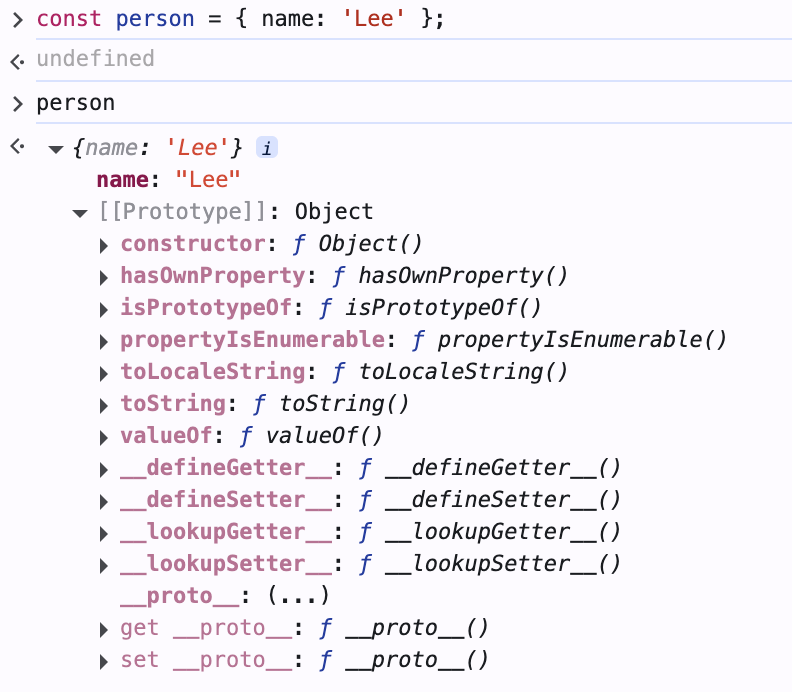
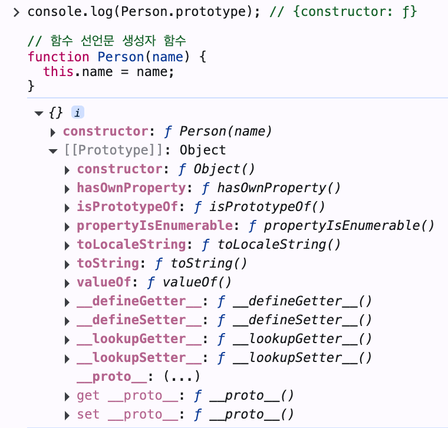

- 자바스크립트는 프로토타입을 기반으로 상속을 구현함
    - 생성자 함수를 통해 만들어진 인스턴스들은 메서드를 공유해서 사용함

### [[protoype]]

- 모든 객체는 하나의 프로토타입을 가질 수 있다.
- 객체의 프로토타입은 **[[prototype]]** 이라는 내부 슬릇에 저장된다.
    - 프로토타입이 없는 경우는 이 내부 슬릇이 null 이다.
- 내부슬릇은 직접 접근할 수 없다. 다만 [[prototype]]에 한하여 접근할 수 있도록 접근자 프로퍼티를 제공하고 있다.
    - 이 접근자 프로퍼티는 `__proto__` 이다.

- 실제로 객체를 하나 생성해보면 [[prototype]] 내부슬릇을 가지고 있는걸 확인할 수 있다.


- [[prototype]]에는 Person 의 `Object.prototype` 이 저장되어있다.
    - 정확히 말하면 Object.prototype 을 참조하는 포인터가 저장되어 있다.

### Object.prototype

- 프로토타입 체인의 최상위에 위치한 객체
    - 아담과 같은 존재
- 모든 객체가 상속받는 메서드와 프로퍼티등을 가지고 있음
- 본인의 [[Prototype]] 은 null 임 (체인의 끝)
- 추가설명

  `Object.prototype`은 자바스크립트의 프로토타입 시스템에서 정말 중요한 근본적인 존재라고 볼 수 있습니다. '아담'이라는 비유는 적절한 표현이라고 생각합니다!

  ## Object.prototype의 특별한 위치

  `Object.prototype`은 자바스크립트의 프로토타입 체인의 최상위에 위치합니다(null 바로 아래). 거의 모든 자바스크립트 객체는 결국 이 `Object.prototype`을 상속받게 됩니다. 그래서 일종의 '만물의 조상'이라고 볼 수 있습니다.

  하지만 정확히 말하자면, `Object.prototype`은 모든 객체의 직접적인 프로토타입은 아닙니다. 각 객체 타입은 자신만의 프로토타입 객체를 가지고 있습니다:

    ```jsx
    // 일반 객체의 경우
    const obj = {};
    console.log(obj.__proto__ === Object.prototype); // true
    
    // 배열의 경우
    const arr = [];
    console.log(arr.__proto__ === Array.prototype); // true
    console.log(arr.__proto__.__proto__ === Object.prototype); // true
    
    // 함수의 경우
    const fn = function() {};
    console.log(fn.__proto__ === Function.prototype); // true
    console.log(fn.__proto__.__proto__ === Object.prototype); // true
    
    ```

  ## 프로토타입 체인의 구조

  자바스크립트의 프로토타입 체인은 일종의 가계도와 같습니다:

    1. 각 타입별 객체(배열, 함수 등)는 자신의 직계 조상인 `[타입].prototype`에게 기본 기능을 물려받습니다.
    2. 이 타입별 프로토타입들은 모두 `Object.prototype`을 공통 조상으로 가집니다.
    3. `Object.prototype`은 프로토타입 체인의 종점인 `null`을 가리킵니다.

  예를 들어 배열의 프로토타입 체인을 시각화하면:

    ```
    [1, 2, 3] → Array.prototype → Object.prototype → null
    ```

  ## Object.prototype의 특별한 역할

  `Object.prototype`이 아담과 같은 존재라고 볼 수 있는 이유는:

    1. **기본 메서드 제공**: `toString()`, `hasOwnProperty()` 같은 기본 메서드들을 모든 객체에 제공합니다.
    2. **프로토타입 접근 수단 제공**: `__proto__` 접근자 프로퍼티는 `Object.prototype`에 정의되어 있어서 대부분의 객체가 이를 상속받아 프로토타입을 조작할 수 있게 됩니다.
    3. **객체 시스템의 근간**: 자바스크립트의 객체 지향 프로그래밍 패러다임의 기초를 형성합니다.

  ## 예외 케이스도: 직접 생성된 객체

  자바스크립트에서는 `Object.create(null)`을 사용하여 프로토타입이 없는(프로토타입이 null인) 객체를 만들 수 있습니다:

    ```jsx
    const noProtoObj = Object.create(null);
    console.log(noProtoObj.__proto__); // undefined
    console.log(Object.getPrototypeOf(noProtoObj)); // null
    ```

  이런 객체는 프로토타입 체인에서 완전히 독립된 '아담 이전의 존재'라고 볼 수 있습니다. 이런 객체는 `toString()`이나 `hasOwnProperty()` 같은 기본 메서드도 가지고 있지 않습니다.

  ## 결론

  `Object.prototype`은 대부분의 자바스크립트 객체가 공유하는 공통 조상이자, 프로토타입 체인의 최상위(null 바로 아래)에 위치하는 특별한 객체입니다. 아담이라는 비유는 꽤 적절합니다 - 거의 모든 객체가 이 조상으로부터 기본적인 특성과 기능을 물려받기 때문입니다. 하지만 모든 객체가 직접적으로 `Object.prototype`을 프로토타입으로 가지는 것은 아니고, `Object.create(null)`로 만든 객체처럼 예외도 있다는 점을 기억해두면 좋겠습니다.


### __proto__

- 원칙적으로 개발자는 내부슬릇과 내부메서드에 접근할 수 없다.
- 그러나 프로토타입에 한해서는 접근할 수 있도록 해줬는데 그 방법이 `__proto__` 접근자 프로퍼티이다.
- [[prototype]]  슬릇에 저장되어있는 `Object.prototype` 에 본인에게 get,set 할 수 있는 접근자 프로퍼티를 만들어 접근이 가능하게 하였다.
    - 즉, Object.protoype 은 `__proto__`  라는 접근자 프로퍼티를 가지고있다.
        - 각 객체는 저 마다의 Object.prototype 을 가지고 있기 때문에 접근자 프로퍼티로 본인의 프로퍼티에 접근할 수 있다.
        - 접근자 프로퍼티이기 때문에 내부에 [[get]] , [[set]] 내부슬릇을 가지고있다.

        ```tsx
        const obj = {}
        const parent = { x: 1 };
        
        // get __proto__ 가 호출되어 obj 객체의 프로토타입 획득
        obj.__proto__;
        
        // set __proto__ 가 호출되어 obj 객체의 프로토타입을 교체
        obj.__proto__ = parent;
        
        console.log(obj.x); // 1|
        ```

        - 해당 코드 추가설명

          자바스크립트의 프로토타입 시스템에 대한 좋은 질문들입니다. 하나씩 자세히 설명해 드리겠습니다.

          ## 1. 빈 객체의 프로토타입

          > obj 변수에 할당된 객체는 아무런 프로퍼티나 메서드도 없는데 얘도 프로토타입을 가지고있어? 있다면 그 프로토타입의 형태는 뭐야?
          >

          네, 자바스크립트에서 빈 객체(`{}`)를 생성하더라도 이 객체는 기본적으로 프로토타입을 가지고 있습니다. 모든 일반 객체는 생성될 때 자동으로 `Object.prototype`을 프로토타입으로 가지게 됩니다.

          `Object.prototype`은 다음과 같은 메서드와 프로퍼티들을 포함하고 있습니다:

            - `toString()`
            - `valueOf()`
            - `hasOwnProperty()`
            - `isPrototypeOf()`
            - `propertyIsEnumerable()`
            - `__proto__` (접근자 프로퍼티)
            - `constructor`

          이것이 빈 객체에서도 `toString()` 같은 메서드를 호출할 수 있는 이유입니다. 객체가 직접 이 메서드를 가지고 있지 않아도, 프로토타입 체인을 통해 `Object.prototype`에서 찾아서 실행합니다.

            ```jsx
            const obj = {};
            console.log(obj.__proto__ === Object.prototype); // true
            console.log(Object.getPrototypeOf(obj) === Object.prototype); // true
            ```

          ## 2. 프로토타입 할당하기

          > obj.proto; 를 통해 조회한 프로토타입을 다른데다가 할당할 수도 있어?
          >

          네, 가능합니다. `obj.__proto__`를 통해 얻은 프로토타입 객체(이 경우 `Object.prototype`)를 다른 변수에 할당하거나 다른 객체의 프로토타입으로 설정할 수 있습니다.

            ```jsx
            const obj = {};
            const prototypeOfObj = obj.__proto__; // Object.prototype을 참조
            
            const anotherObj = {};
            anotherObj.__proto__ = prototypeOfObj; // 동일한 결과 (이미 Object.prototype이므로 변화 없음)
            
            // 다른 객체의 프로토타입으로 활용할 수도 있습니다
            const customObj = {
              customMethod() { return "Hello!" }
            };
            
            const newObj = {};
            newObj.__proto__ = customObj;
            console.log(newObj.customMethod()); // "Hello!"
            ```

          프로토타입은 단순히 객체이므로 다른 객체와 마찬가지로 변수에 할당하거나 전달할 수 있습니다.

          ## 3. 프로토타입 설정의 의미

          > obj.proto = parent; 이거는 obj 의 프로토타입이 parent가 된거야 아니면 parent의 프로토타입이 된거야?
          >

          `obj.__proto__ = parent;`는 "obj의 프로토타입이 parent가 된다"는 의미입니다.

          이 코드는 obj 객체의 내부 슬롯 `[[Prototype]]`이 parent 객체를 참조하도록 변경합니다. 이렇게 하면 obj에서 직접 찾을 수 없는 프로퍼티나 메서드를 접근할 때, 자바스크립트 엔진은 parent 객체에서 해당 프로퍼티나 메서드를 찾게 됩니다.

          해당 예제에서는:

            ```jsx
            obj.__proto__ = parent;
            console.log(obj.x); // 1
            
            ```

          obj 자체에는 x 프로퍼티가 없지만, obj의 프로토타입인 parent에 x 프로퍼티가 있기 때문에 `obj.x`로 접근할 수 있고 그 값 1을 반환합니다.

          프로토타입 체인은 다음과 같이 형성됩니다:

            ```
            obj -> parent -> Object.prototype -> null
            ```

          obj에서 특정 프로퍼티를 찾을 때, 먼저 obj 자체에서 찾아보고, 없으면 parent에서 찾고, 여기서도 없으면 Object.prototype에서 찾고, 그래도 없으면 undefined를 반환합니다.

          프로토타입을 설정하는 현대적인 방법은 다음과 같습니다:

            ```jsx
            Object.setPrototypeOf(obj, parent); // obj.__proto__ = parent와 동일한 효과
            ```

          이것은 프로토타입 기반 상속의 핵심 메커니즘이며, 자바스크립트의 객체 지향 프로그래밍 구현 방식의 기초가 됩니다.

- 다만 사용하기를 지양하며 아래와 같은 메서드를 사용하기를 권장함
    - `Object.getPrototypeOf(obj)` : 객체의 프로토타입 조회
    - `Object.setPrototypeOf(obj, prototype)` : 객체의 프로토타입을 설정
    - 하위 환성을 위해 공식 스펙으로 지정되었으나 문제가 있음
        - Object.protoype 이 없는 경우에 문제가 생길 수 있음

        ```tsx
        // Object.create(null) 로 생성한 객체는 프로토타입이 없음.. 지가 아담임
        const obj = Object.create(null);
        
        // 따라서 obj는 Object.prototype 으로부터 상속받은 __proto__ 접근자 프로퍼티가 없음
        console.log(obj.__proto__); // undefined
        console.log(Object.getPrototypeOf(obj)); // null
        ```

- 프로토타입 체인과 `__proto__` 값 예시

    ```tsx
    [1, 2, 3] → Array.prototype → Object.prototype → null
    ```

  ## 프로토타입 체인에서의 **proto**

  배열 `[1, 2, 3]`을 시작으로 프로토타입 체인을 따라가 보겠습니다:

  ### 1단계: 배열 객체 → Array.prototype

    ```jsx
    const arr = [1, 2, 3];
    
    // 배열의 __proto__는 Array.prototype을 가리킵니다
    console.log(arr.__proto__ === Array.prototype); // true
    
    ```

  배열 객체의 `__proto__`는 `Array.prototype`을 가리킵니다. 이것은 배열이 `push()`, `pop()`, `map()` 등의 메서드를 사용할 수 있는 이유입니다.

  ### 2단계: Array.prototype → Object.prototype

    ```jsx
    // Array.prototype의 __proto__는 Object.prototype을 가리킵니다
    console.log(arr.__proto__.__proto__ === Object.prototype); // true
    console.log(Array.prototype.__proto__ === Object.prototype); // true
    
    ```

  `Array.prototype` 자체도 객체이므로 프로토타입을 가집니다. `Array.prototype`의 `__proto__`는 `Object.prototype`을 가리킵니다. 이 덕분에 배열도 `toString()`, `hasOwnProperty()` 같은 메서드를 사용할 수 있습니다.

  ### 3단계: Object.prototype → null

    ```jsx
    // Object.prototype의 __proto__는 null입니다
    console.log(arr.__proto__.__proto__.__proto__ === null); // true
    console.log(Object.prototype.__proto__ === null); // true
    
    ```

  `Object.prototype`의 `__proto__`는 `null`입니다. 이것은 프로토타입 체인의 끝을 의미합니다. 여기서부터는 더 이상 프로토타입이 없습니다.

  ## 프로토타입 체인 탐색의 실제 모습

  실제로 자바스크립트 엔진이 프로퍼티나 메서드를 찾는 과정을 예시로 살펴보겠습니다:

    ```jsx
    const arr = [1, 2, 3];
    
    // 1. push 메서드 호출 - Array.prototype에서 찾음
    arr.push(4); // [1, 2, 3, 4]
    
    // 2. toString 메서드 호출 - Object.prototype에서 찾음
    console.log(arr.toString()); // "1,2,3,4"
    
    // 3. nonExistentMethod 호출 시도 - 어디에도 없음
    // arr.nonExistentMethod(); // TypeError: arr.nonExistentMethod is not a function
    
    ```

  이 과정에서 자바스크립트 엔진은 다음과 같이 동작합니다:

    1. `arr` 객체 자체에서 메서드를 찾습니다.
    2. 찾지 못하면 `arr.__proto__`(Array.prototype)에서 찾습니다.
    3. 여기서도 못 찾으면 `arr.__proto__.__proto__`(Object.prototype)에서 찾습니다.
    4. 여기서도 못 찾으면 `arr.__proto__.__proto__.__proto__`를 확인하는데, 이것은 `null`이므로 탐색을 중단하고 `undefined`를 반환합니다.

  ## 각 단계에서의 **proto** 속성 깊이 살펴보기

  각 단계별로 `__proto__` 속성이 실제로 어떻게 정의되어 있는지 살펴보겠습니다:

  ### 배열 객체의 **proto**

  배열 객체 자체는 `__proto__` 속성을 직접 가지고 있지 않습니다. 대신, 이 속성은 `Object.prototype`에 정의된 접근자 프로퍼티를 통해 상속받습니다.

    ```jsx
    const arr = [1, 2, 3];
    console.log(arr.hasOwnProperty('__proto__')); // false
    ```

  ### Array.prototype의 **proto**

  `Array.prototype` 역시 `__proto__` 속성을 직접 가지고 있지 않고, `Object.prototype`에서 상속받습니다.

    ```jsx
    console.log(Array.prototype.hasOwnProperty('__proto__')); // false
    ```

  ### Object.prototype의 **proto**

  `Object.prototype`에는 실제로 `__proto__` 접근자 프로퍼티가 정의되어 있습니다. 이것이 프로토타입 체인에서 모든 객체가 `__proto__`를 사용할 수 있는 이유입니다.

    ```jsx
    console.log(Object.prototype.hasOwnProperty('__proto__')); // true
    
    // Object.prototype의 __proto__ 속성 자세히 살펴보기
    const descriptor = Object.getOwnPropertyDescriptor(Object.prototype, '__proto__');
    console.log(descriptor);
    // {get: f(), set: f(), enumerable: false, configurable: true}
    
    ```

  이 접근자 프로퍼티는 객체의 내부 슬롯 `[[Prototype]]`에 접근하기 위한 getter와 setter 함수를 제공합니다.

  ## 시각적 표현

  프로토타입 체인과 `__proto__`의 관계를 도식화하면:

    ```
    [1, 2, 3] (배열 객체)
        |
        | .__proto__ (상속된 접근자 프로퍼티)
        ↓
    Array.prototype (배열 메서드들)
        |
        | .__proto__ (상속된 접근자 프로퍼티)
        ↓
    Object.prototype (객체 메서드들 + __proto__ 접근자 프로퍼티 정의)
        |
        | .__proto__ (직접 정의된 접근자 프로퍼티, 값은 null)
        ↓
    null (체인의 끝)
    
    ```

  이 구조를 이해하면 자바스크립트의 상속 메커니즘과 객체 시스템의 작동 방식을 더 깊이 파악할 수 있습니다. 자바스크립트는 이러한 프로토타입 체인을 통해 다른 언어의 클래스 기반 상속을 흉내내면서도 더 유연한 객체 시스템을 구현하고 있습니다.


## protoype

- 객체 중에 함수는 `protoype` 이라는 프로퍼티를 가지고있다.
- 이 프로퍼티는 **생성자 함수가 생성할 인스턴스의 프로토타입**을 가리킨다.
    - 따라서 생성자 함수로 호출할 수 없는 **non-constructor** 함수들은 `protoype` 프로퍼티를 가지고 있지 않으며 프로토타입도 생성하지 않는다.
    - 화살표 함수, 메서드 축약표현 등

    ```tsx
    const Person = name => {
    	this.name = name;
    };
    
    // non-constructor 는 protoype 프로퍼티를 소유하지않음
    console.log(Person.hasOwnProperty('prototype')); // false
    
    // non-constructor 는 프로토타입을 생성하지않음
    console.log(Person.prototype); // undefined
    
    // ES6의 메서드 축약 표현으로 정의한 메서드는 non-constructor 다.
    const obj = {
    	foo() {}
    }
    
    // non-constructor 는 protoype 프로퍼티를 소유하지않음
    console.log(obj.foo.hasOwnProperty('prototype')); // false
    
    // non-constructor 는 프로토타입을 생성하지 않는다.
    console.log(obj.foo.prototype); // undefined
    ```

    - 뿐만 아니라 생성자 함수로 호출하지 않을 일반 함수들도(선언,표현 둘 다) `prototype` 프로퍼티는 가지고 있으나 아무런 의미가 없다.
- `prototype` 프로퍼티의 목적은 생성자 함수가 자신이 생성할 인스턴스들의 프로토타입을 지정해주기 위함이다.
    - 따라서 인스턴스의 프로토타입이 될 프로토타입의 참조를 가지고있다.

- 이러한 `protoype` 프로퍼티를 통해 생성될(된) 인스턴스들의 프로토타입 동작을 변경함으로서 모든 인스턴스의 프로퍼티나 메서드 동작을 수정할 수 있다.

  ### 생성자 함수 내부에 메서드 정의 (인스턴스 메서드)

    ```jsx
    function Person(name) {
      this.name = name;
    
      // 인스턴스 메서드 - 각 객체마다 독립적으로 생성됨
      this.sayHello = function() {
        console.log(`안녕하세요, ${this.name}입니다!`);
      };
    }
    
    const person1 = new Person('철수');
    const person2 = new Person('영희');
    
    console.log(person1.sayHello === person2.sayHello); // false - 서로 다른 함수 객체
    
    ```

  ### 프로토타입에 메서드 정의 (프로토타입 메서드)

    ```jsx
    function Person(name) {
      this.name = name;
    }
    
    // 프로토타입 메서드 - 모든 인스턴스가 공유
    Person.prototype.sayHello = function() {
      console.log(`안녕하세요, ${this.name}입니다!`);
    };
    
    const person1 = new Person('철수');
    const person2 = new Person('영희');
    
    console.log(person1.sayHello === person2.sayHello); // true - 동일한 함수 객체
    ```

    - 모든 인스턴스가 공용으로 사용할 프로퍼티나 메서드를 `prototype` 객체에 지정해두면 중복 생성 없이 인스턴스들이 공유해서 사용할 수 있음
    - 클래스 방식은 자동으로 프로토타입 메서드로 만듦

### `__proto__`  와의 차이

- 모든 객체가 가지고 있는 `__proto__`  프로퍼티와 함수만 가지고 있는 `protoype` 프로퍼티는 결국 동일한 프로토타입을 가리킨다.

    ```tsx
    function Person(name) {
    	this.name = name;
    }
    
    const me = new Person('Lee');
    
    // 함수 Person의 프로토타입과 그 생성자 함수로부터 만들어진 객체(인스턴스) me의 프로토타입은 같다.
    console.log(Person.prototype === me.__proto__); //true
    ```


- 하지만 이 둘의 목적은 다소 다른데 아래 표를 참고

| 구분 | 소유 | 값 | 사용주체 | 사용목적 |
| --- | --- | --- | --- | --- |
| __proto__ | 모든 객체 | 프로토타입의 참조 | 모든 객체 | 객체가 자신의 프로포타입에 접근 또는 교체하기 위해 사용 |
| protoype 프로퍼티 | constructor | 프로토타입의 참조 | 생성자 함숩 | 생성자 함수가 자신이 생성할 객체(인스턴스)의 프로토타입을 할당하기 위해 사용 |

### constructor

- `constructor` 프로퍼티는 본인의 **생성자 함수 자체**를 가리킨다.
    - 대부분의 프로토타입은(특히 함수) `constructor` 프로퍼티를 갖는다.
        - Object.prototype 이 `constructor` 프로퍼티를 가지고 있기 때문에 자식 객체들이 직접 가지고 있지 않아도 프로토타입 체인으로 접근할 수 있다.
        - Object.create(null); 로 만들어진 객체와 하위 프로토타입들은 constructor 프로퍼티가 없다.
          → 그래서 대부분이라고함
- `prototype`  프로퍼티가 생성자 함수를 통해 생성될 인스턴스들의 프로토타입을 지정해주기 위해 부모가 될 프로토타입의 참조값을 지니고 있었다면 `constructor` 는 그 부모가 될 프로토타입이 본인의 생성자 함수(=본인의 참조값을 저장한 `prototype` 를 가지고 있는 생성자 함수) 의 참조값을 가지고 있다.

    ```tsx
    생성자 함수 --(prototype)--> 프로토타입 객체
    프로토타입 객체 --(constructor)--> 생성자 함수
    ```

- 생성자 함수를 통해 만들어진 인스턴스들은 본인의 프로토타입이 가진 `constructor` 프로퍼티를 프로토체인을 통해 본인의 생성자 함수로 접근할 수 있다.

    ```tsx
    function Person(name) {
      this.name = name;
    }
    
    const instance = new Person('kim');
    
    console.log(instance.constructor === Person); // true
    
    // 프로토타입 객체의 constructor 프로퍼티는 다시 생성자 함수를 가리킴
    console.log(Person.prototype.constructor === Person); // true
    ```

- `constructor` 의 연결은 함수 객체가 생성될 때 이루어지므로 케이스마다 다르다.
    1. 일반적인 생성자 함수와 프로토타입

    ```jsx
    function Person(name) {
        this.name = name;
    }
    
    // Person.prototype은 constructor 프로퍼티를 가짐
    // 본인의 생성자 함수를 가리킴
    console.log(Person.prototype.constructor === Person); // true
    
    // 인스턴스도 프로토타입을 통해 constructor에 접근 가능
    const person1 = new Person('Alice');
    
    // 엄밀히 말하면 person1 객체는 constructor 프로퍼티가 없지만 프로토타입 체인을 통해
    // 본인의 프로토타입에 있는 constructor에 접근한다 
    console.log(person1.constructor === Person); // true
    console.log(person1.__proto__.constructor === Person); // 위와 동일
    console.log(person1.protoype.constructor === Person); // person1은 함수가 아닌 객체이므로 protoype 프로퍼티를 사용할 수는 없다.
    ```

    - 생성자 함수를 통해 만들어진 객체(= 이하 인스턴스)는 생성자 함수와 동일한 프로토타입을 공유하기 때문에 프로토타입 체인을 통해 생성자 함수와 같은 `constructor` 프로퍼티에 접근할 수 있다.

    - 그외 빌트인 생성자 함수들

    ```jsx
    // obj 객체를 생성한 생성자 함수는 Object 이다.
    const obj = new Object();
    console.log(obj.constructor === Object); // true
    
    // add 함수 객체를 생성한 생성자 함수는 Function 이다.
    const add = new Function('a', 'b', 'return a + b');
    console.log(add.constructor === Function); // true
    ```

    - 이 때 Object 생성자 함수에 인수로 전달하지 않으면 *OrdinaryObjectCreate* 추상연산을 호출하여 `Object.prototype`을 프로토타입으로 갖는 빈 객체를 생성한다.

        ```jsx
        // 인수가 전달되지 않아 OrdinaryObjectCreate 를 호출하여 빈 객체를 생성한다
        let obj = new Object();
        console.log(obj); // {}
        ```


    2. 객체 리터럴의 경우
    
    ```jsx
    const obj = {};
    
    // *OrdinaryObjectCreate* 추상연산을 호출했기 때문에 프로토타입으로 Object.prototype
    console.log(obj.__proto__ === Object.prototype) // true
    
    // 객체 리터럴로 생성된 객체의 constructor는 Object 함수
    // 그럼 객체 리터럴의 생성자 함수가 Obejct 인걸까?
    console.log(obj.constructor === Object); // true
    ```
    
    - 객체 리터럴은 *OrdinaryObjectCreate* 추상연산을 호출하여 빈 객체를 생성한다.
    - 객체 리터럴은 Object 생성자 함수를 통해 만들어진 객체들과 다른 특징을 가지고 있다.
        - 따라서 객체 리터럴은 Object 생성자 함수로 만들어진 객체가 아니다.
        - 그럼에도 불구하고 constructor 가 Object인 이유는 프로토타입과 생성자 함수는 단독으로 존재할 수 없고 언제나 쌍(pair)으로 존재해야하기 때문이다.
            - Function, Array 등도 마찬가지.. 리터럴 표기법으로 만들어진 각 객체들은 생성자 함수를 통해 만들어진 객체와 스코프, 클로저등의 차이는 있지만 본질적으로는 같다. 따라서 리터럴 표기를 통해 만들어진 객체의 프로로타입과 쌍을 맺어주기위해 본질적으로는 같은 각 생성자 함수를 constructor 로 지정한 것이다.


### 생성자 함수와 프로토타입 생성 시점

- 위에서 보았듯이 리터럴 표기법으로 객체를 생성하더라도 생성자 함수와 연결되는 것을 확인할 수 있었다.
    - 객체는 객체 리터럴로 생성하더라도 Object 객체 생성자와 연결되는 것을 확인할 수 있었다.
    - 함수는 함수 리터럴로 생성하더라도 Function 함수 생성자와 연결되어있다.

    ```jsx
    // 함수 리터럴(함수 표현식)로 함수 생성
    const funcLiteral = function() {};
    
    // Function 생성자 함수와의 연결 확인
    console.log(funcLiteral.constructor === Function); // true
    console.log(funcLiteral.__proto__ === Function.prototype); // true
    
    // 함수 선언문으로 함수 생성
    function funcDeclaration() {}
    
    // Function 생성자 함수와의 연결 확인
    console.log(funcDeclaration.constructor === Function); // true
    console.log(funcDeclaration.__proto__ === Function.prototype); // true
    ```

    - 이 외 배열 리터럴, 정규 표현식 리터럴 등도 동일하다.
    - 따라서 **모든 객체는 생성자 함수와 연결되어있는 것을 알 수 있다.**

- 프로토타입은 생성자 함수가 생성되는 시점에 더불어 생성된다.
- JavaScript에서 모든 함수 객체는 내부 슬롯(internal slot)들을 가지고 있다. 그 중 중요한 2가지 슬릇이 있다.
    1. **[[Call]]** - 모든 함수 객체가 가지는 내부 슬롯으로, 함수로서 호출될 수 있게 합니다.
    2. **[[Construct]]** - 일부 함수만 가지는 내부 슬롯으로, `new` 연산자와 함께 생성자로 호출될 수 있게 합니다.
        1. 해당 슬릇이 있는 함수는 constructor , 없는 함수는 non-constructor 라고 부른다.
  - 생성자 함수로서 호출할 수 있는 함수, 즉 constructor는 함수 정의가 평가되어 함수 객체를 생성하는 시점에 프로토타입도 더불어 생성된다.
      1. JavaScript 엔진이 함수 선언문 또는 함수 표현식을 평가합니다.
      2. 함수 객체를 생성하고, 이 함수에 `[[Call]]`과 `[[Construct]]` 내부 슬롯을 부여합니다.
      3. 동시에 프로토타입 객체를 생성하고, 함수의 `prototype` 프로퍼티가 이 객체를 참조하도록 합니다.
      4. 프로토타입 객체의 `constructor` 프로퍼티는 함수 객체를 참조하도록 설정합니다.

      - 예를 들어 대표적인 constructor 인 함수 선언문의 경우

          ```jsx
          // 함수 정의(constructor)가 평가되어 함수 객체를 생성하는 시점에 프로토타입도 더불어 생성된다
          console.log(Person.prototype); // {constructor: ƒ}
        
          // 함수 선언문 생성자 함수
          function Person(name) {
            this.name = name;
          }
          ```

      
        함수 선언문 생성자 함수가 만든 프로토타입 객체의 프로터티들이다.
        지금까지 공부한 내용들을 떠올리며 음미해보자
        → constructor 는 본인과 쌍으로 연결된 생성자 함수 Person 을 가리킨다
        → [[Prototype]] 은 프로토타입 본인의 프로토타입을 가리킨다 여기서는 최상위 아담 프로토타입인 Object를 가리키고 있다.

- 그러면 non-constructor 함수의 프로토타입은 어떻게 될까?
    - 대표적인 non-constructor 함수인 화살표함수와 메서드 축약표현을 예로 알아보자.

        ```jsx
        const arrowFunc = () => {};
        const obj = { method() {} };
        
        new arrowFunc(); // TypeError: arrowFunc is not a constructor
        new obj.method(); // TypeError: obj.method is not a constructor
        ```

      이들은 non-constructor 이기 때문에 `new` 키워드로 호출할 수 없다. 이는 **해당 함수를 통해 인스턴스를 생성하지 않겠다는 뜻이기도 하고 그렇기 때문에 프로토타입을 가질 이유도 없다.**

      따라서 non-constructor 는 생성자 함수로서 오용될 일 없이 함수 그 자체로서의 기능에 충실할 수 있다. (그러면 non-constructor 를 진짜 함수로 쓰고 constructor 나 class 를 인스턴스 발사대로 쓰는게 좋겠군)

        - 그렇게 사용하는 예시

            ```jsx
            // 단순 기능 수행 - 화살표 함수 사용 (non-constructor)
            const calculateArea = (width, height) => width * height;
            
            // 데이터 변환 - 화살표 함수 사용 (non-constructor)
            const formatName = user => `${user.firstName} ${user.lastName}`;
            
            // 객체 메서드 - 메서드 축약 표현 사용 (non-constructor)
            const user = {
              name: 'John',
              sayHello() {
                return `Hello, I'm ${this.name}`;
              }
            };
            
            // 객체 생성 패턴 - 클래스 또는 생성자 함수 사용 (constructor)
            class Person {
              constructor(name, age) {
                this.name = name;
                this.age = age;
              }
              
              introduce() {
                return `I'm ${this.name}, ${this.age} years old`;
              }
            }
            
            // 또는 생성자 함수 패턴
            function Product(name, price) {
              this.name = name;
              this.price = price;
            }
            
            Product.prototype.getDiscountedPrice = function(discount) {
              return this.price * (1 - discount);
            };
            ```


        ```jsx
        const ArrowFunc = name => {
        	this.name = name;
        };
        
        // non-constructor는 프로토타입이 생성되지 않는다
        console.log(ArrowFunc.prototype); // undefined
        ```
        
        - 참고 메서드 축약표현 기본 문법
            
            메서드 축약 표현(method shorthand)은 ES6(ECMAScript 2015)에서 도입된 객체 리터럴의 확장 문법입니다. 이 문법에는 특정한 규칙과 특성이 있습니다.
            
            ## 메서드 축약 표현의 기본 문법
            
            전통적인 객체 리터럴에서는 메서드를 정의할 때 함수 표현식을 사용했습니다:
            
            ```jsx
            // ES5 이전 방식
            const person = {
              name: 'John',
              sayHello: function() {
                return `Hello, I'm ${this.name}`;
              }
            };
            ```
            
            ES6의 메서드 축약 표현에서는 `function` 키워드와 콜론(`:`)을 생략할 수 있습니다:
            
            ```jsx
            // ES6 메서드 축약 표현
            const person = {
              name: 'John',
              sayHello() {
                return `Hello, I'm ${this.name}`;
              }
            };
            ```
            
            ## 메서드 축약 표현의 특징과 규칙
            
            1. **Non-constructor 함수 생성**
                - 메서드 축약 표현으로 정의된 함수는 `[[Construct]]` 내부 슬롯을 갖지 않습니다.
                - 따라서 `new` 연산자로 호출할 수 없고, `prototype` 프로퍼티도 없습니다.
                
                ```jsx
                const obj = {
                  method() {}
                };
                
                console.log(obj.method.prototype); // undefined
                // new obj.method(); // TypeError: obj.method is not a constructor
                
                ```
                
            2. **super 키워드 사용 가능**
                - 메서드 축약 표현으로 정의된 메서드에서만 `super` 키워드를 사용할 수 있습니다.
                - 일반 함수에서는 `super`를 사용할 수 없습니다.
                
                ```jsx
                const parent = {
                  sayHi() {
                    return 'Hi from parent';
                  }
                };
                
                const child = {
                  __proto__: parent,
                  // 메서드 축약 표현으로 정의된 메서드는 super 사용 가능
                  sayHi() {
                    return super.sayHi() + ', and child';
                  },
                
                  // 일반 함수 방식으로 정의된 메서드는 super 사용 불가
                  regularMethod: function() {
                    // return super.sayHi(); // SyntaxError: 'super' keyword unexpected here
                    return 'Regular method';
                  }
                };
                
                console.log(child.sayHi()); // "Hi from parent, and child"
                
                ```
                
            3. **내부 this 바인딩**
                - 메서드 축약 표현으로 정의된 메서드는 일반 함수와 동일하게 동적 `this` 바인딩을 합니다.
                - 화살표 함수와 달리, 호출 시점에 `this`가 결정됩니다.
                
                ```jsx
                const obj = {
                  name: 'Object',
                  regularMethod() {
                    return this.name;
                  },
                  arrowMethod: () => this.name // 이것은 lexical this를 사용
                };
                
                console.log(obj.regularMethod()); // "Object"
                
                const otherContext = { name: 'Other', method: obj.regularMethod };
                console.log(otherContext.method()); // "Other" (호출 컨텍스트에 따라 this가 변경됨)
                
                ```
                
            4. **계산된 프로퍼티 이름(Computed Property Names)과 함께 사용 가능**
                - 메서드 이름을 동적으로 결정할 수 있습니다.
                
                ```jsx
                const methodName = 'sayGreeting';
                const greeting = 'Hello';
                
                const obj = {
                  [methodName]() {
                    return greeting;
                  }
                };
                
                console.log(obj.sayGreeting()); // "Hello"
                
                ```
                
            5. **생성자 함수와의 차이**
                - 일반 함수 표현식으로 정의된 메서드는 생성자 함수로 사용 가능합니다.
                - 메서드 축약 표현으로 정의된 메서드는 생성자 함수로 사용할 수 없습니다.
                
                ```jsx
                const obj1 = {
                  Constructor: function() {
                    this.value = 42;
                  }
                };
                
                const obj2 = {
                  NonConstructor() {
                    this.value = 42;
                  }
                };
                
                const instance = new obj1.Constructor();
                console.log(instance.value); // 42
                
                // const error = new obj2.NonConstructor(); // TypeError: obj2.NonConstructor is not a constructor
                
                ```
                
            
            ## 메서드 축약 표현을 사용해야 하는 경우
            
            메서드 축약 표현은 특히 다음과 같은 경우에 권장됩니다:
            
            1. 객체의 메서드를 정의할 때 (일반적인 경우)
            2. 프로토타입 메서드를 정의할 때
            3. 클래스의 메서드를 정의할 때
            4. `super` 키워드를 사용해야 할 때
            
            이러한 규칙과 특성을 이해하면 JavaScript에서 객체와 메서드를 더 효과적으로 설계하고 구현할 수 있습니다. 메서드 축약 표현은 코드의 가독성을 높이면서도 함수의 용도(객체 메서드)를 명확히 하는 데 도움이 됩니다.


### 프로토타입 체인

- 자바스크립트는 객체의 프로퍼티(메서드 포함)에 접근하려고 할 때 해당 객체에 접근하려는 프로퍼티가 없다면 [[Prototype]] 내부 슬릇의 참조를 따라 자신의 부모 역할을 하는 프로토타입의 프로퍼티를 순차적으로 검색한다. 이를 프로토타입 체인이라고 한다.
- 프로토타입 체인의 최상위에 위치하는 객체는 언제나 Object.protoype 이다.
    - 체인의 종점

### instanceof 연산자

```jsx
객체 instanceof 생성자 함수
```

- instanceof 연산자는 이항 연산자로서 좌변에 객체를 가리키는 식별자, 우변에 생성자 함수를 가리키는 식별자를 피연산자로 받는다.
    - 우변의 피연산자가 함수가 아닌 경우 TypeError 가 발생한다.
- 우변 생성자 함수의 `prototype` 에 바인딩 된 프로토타입 객체가 좌변 객체의 프로토타입 체인 상에 존재하면 true, 그렇지 않으면 false로 평가된다.

```jsx
function Person(name) {
	this.name = name;
}

const me = new Person('Kim');

// Person.prototype 이 me 객체의 프로토타입 체인 상에 존재하므로 treu로 평가된다.
console.log(me instanceof Person); //true

// me 객체의 프로토체인 종점에는 Object.prototype 이 존재하므로 true로 평가된다.
console.log(me instanceof Object); // true
```

- 이름 그대로 어떤 생성자 함수의 인스턴스인지를 판단해주는 연산자

### 정적 프로퍼티/메서드

- 정적 프로퍼티/메서드는 생성자 함수를 인스턴스로 생성하지 않아도 참조/호출할 수 있는 프로퍼티와 메서드를 말한다.

```jsx
function Person(name) {
	this.name = name;
}

// 프로토타입 메서드
Person.prototype.sayHello = function () {
	console.log(`Hi, My name is ${this.name}`);
}

// 정적 프로퍼티
Person.staticProp = 'static prop';

// 정적 메서드
Person.staticMethod = function () {
	console.log(`staticemthod`);
}

const me = new Person('Lee');

// 생성자 함수에 추가한 정적 프로퍼티는 생성자 함수로 참조, 호출함
Person.staticMethod(); // staticmethod

// 인스턴스는 정적 프로퍼티를 호출할 수 없다
// 인스턴스로 참조/호출할 수 있는 프로퍼티는 프로토타입 체인 상에 존재해야한다.
me.staticMethod(); // TypeError: me.staticMethod is not a function

```

- 왜냐면 생성자 함수와 그 생성자 함수를 통해 만들어진 인스턴스는 서로가 프로토타입 체인으로 맺어져있지 않기 때문

### for … in 과 Object.keys/values/entries

- for … in 문은 객체의 프로토타입 상에 존재하는 모든 프로토타입의 프로퍼티 중에서 프로퍼티 어트리뷰트 [[Enumerable]] 값이 true인 프로퍼티를 순회하면서 열거한다.

    ```jsx
    // 생성자 함수 정의
    function Parent() {
      this.parentProperty = '부모 속성';
    }
    
    // 프로토타입에 열거 가능한 메서드 추가
    Parent.prototype.parentMethod = function() {
      return '부모 메서드';
    };
    
    // 프로토타입에 열거 불가능한 메서드 추가
    Object.defineProperty(Parent.prototype, 'hiddenMethod', {
      value: function() { return '숨겨진 메서드'; },
      enumerable: false  // [[Enumerable]]을 false로 설정
    });
    
    // 자식 객체 생성
    const child = new Parent();
    child.childProperty = '자식 속성';
    
    // for...in 문으로 순회
    console.log('for...in으로 child 객체의 모든 열거 가능한 프로퍼티 출력:');
    for (const prop in child) {
      console.log(prop + ': ' + (typeof child[prop] === 'function' ? '함수' : child[prop]));
    }
    
    // 결과:
    // childProperty: 자식 속성
    // parentProperty: 부모 속성
    // parentMethod: 함수
    // (hiddenMethod는 [[Enumerable]]이 false이므로 출력되지 않음)
    ```


```jsx
// 생성자 함수 정의
function Person(name) {
  this.name = name;         // 인스턴스 프로퍼티
  this.age = 30;            // 인스턴스 프로퍼티
}

// 프로토타입에 메서드 추가
Person.prototype.sayHello = function() {
  return `안녕하세요, ${this.name}입니다.`;
};

// 인스턴스 생성
const person = new Person('김철수');

// 1. for...in 루프 (프로토타입 체인의 열거 가능한 모든 프로퍼티를 순회)
console.log('===== for...in 결과 =====');
for (const prop in person) {
  console.log(prop);
}
// 출력:
// name
// age
// sayHello

// 2. Object.keys() (객체 자신의 열거 가능한 프로퍼티 키만 배열로 반환)
console.log('===== Object.keys() 결과 =====');
const keys = Object.keys(person);
console.log(keys);
// 출력: ['name', 'age']

// 3. Object.values() (객체 자신의 열거 가능한 프로퍼티 값만 배열로 반환)
console.log('===== Object.values() 결과 =====');
const values = Object.values(person);
console.log(values);
// 출력: ['김철수', 30]

// 4. Object.entries() (객체 자신의 열거 가능한 프로퍼티 키-값 쌍을 배열로 반환)
console.log('===== Object.entries() 결과 =====');
const entries = Object.entries(person);
console.log(entries);
// 출력: [['name', '김철수'], ['age', 30]]

// hasOwnProperty를 사용한 for...in (자신의 프로퍼티만 필터링)
console.log('===== for...in + hasOwnProperty 결과 =====');
for (const prop in person) {
  if (person.hasOwnProperty(prop)) {
    console.log(prop);
  }
}
// 출력:
// name
// age

```

### 핵심 차이점:

1. **`for...in`**:
    - 객체 자신의 프로퍼티뿐만 아니라 프로토타입 체인 상의 모든 열거 가능한(enumerable) 프로퍼티를 순회합니다.
    - 예제에서는 `name`, `age`(인스턴스 프로퍼티)와 `sayHello`(프로토타입 메서드)가 모두 출력됩니다.
    - 순서가 보장되지 않습니다.
2. **`Object.keys()`, `Object.values()`, `Object.entries()`**:
    - **객체 자신의 프로퍼티만 대상으로 하며, 프로토타입 체인을 따라 상속된 프로퍼티는 포함하지 않습니다.**
    - 오직 열거 가능한(enumerable) 프로퍼티만 반환합니다.
    - 예제에서는 `name`, `age`만 포함되고 `sayHello`는 포함되지 않습니다.
    - `keys`는 키 배열, `values`는 값 배열, `entries`는 [키, 값] 쌍의 배열을 반환합니다.
    - ES2015부터 프로퍼티 순서가 보장됩니다(생성 순서대로).
3. **`for...in` + `hasOwnProperty`**:
    - 이 조합은 프로토타입 체인을 따라 상속된 프로퍼티를 제외하고 객체 자신의 프로퍼티만 순회합니다.
    - 결과적으로 `Object.keys()`와 유사한 동작을 하지만, 구문이 더 길고 순서가 보장되지 않습니다.

### 어떤 상황에서 무엇을 사용해야 할까요?

1. **객체 자신의 프로퍼티만 필요한 경우**: `Object.keys()`, `Object.values()`, `Object.entries()`
2. **프로토타입 체인을 포함한 모든 프로퍼티가 필요한 경우**: `for...in`
3. **구체적인 필터링이 필요한 경우**: `for...in` + 조건문(`hasOwnProperty` 등)

현대 JavaScript에서는 일반적으로 `for...in`보다 `Object.keys()`, `Object.values()`, `Object.entries()`를 더 많이 사용합니다. 이 메서드들은 의도가 명확하고, 필요한 정보만 정확하게 제공하며, 경우에 따라 더 예측 가능한 순서를 보장합니다.