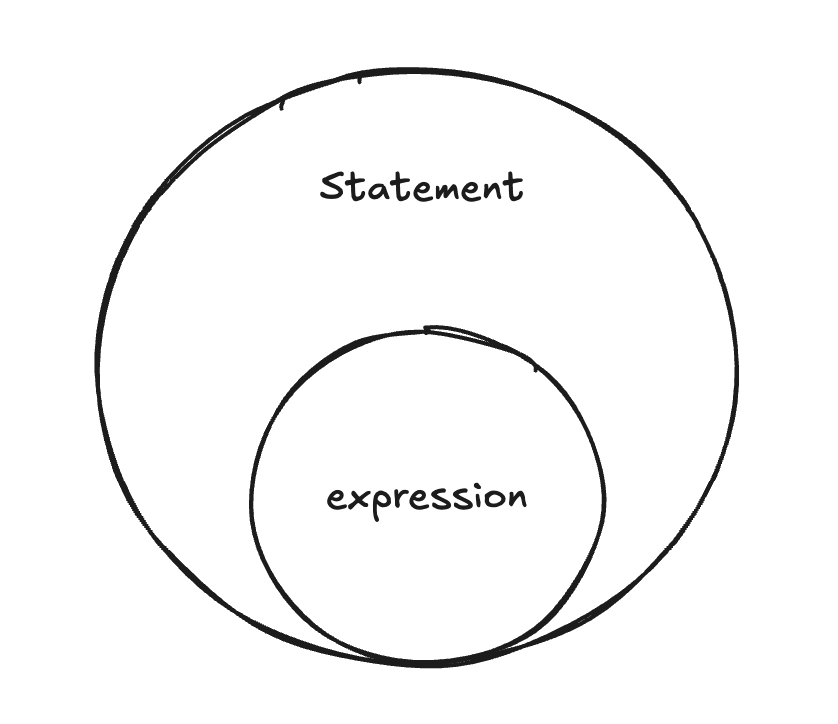

### 값 , value

- 메모리에 2진수로 저장된 데이터
- 모든 값은 데이터 타입을 가짐
- 변수는 값이 할당된 메모리 공간 주소를 참조
- 값은 표현식 (expression) 이 평가 (evalutate) 되어 생성된 결과를 말한다

```bash
10 + 20;  # 30 <- 표현식이 평가되어 생성
-------   -----
 표현식       값
```

### 리터럴, literal

- **사람이 이해할 수 있는** 문자 또는 약속된 기호를 사용해 **값을 생성하는 표기법**(notation)

```bash
3;

# 코드에 3을 작성하면 자바스크립트 엔진은 해당 기호를 숫자 리터럴 3으로 인식하여
# 그에 상응하는 이진수 데이터로 치환해 메모리에 저장한다. (평가)
```

### 표현식, expression

- 값으로 평가될 수 있는 문 (statement)


- 즉, 표현식이 평가되면 새로운 값을 생성하거나 기존 값을 참조한다.
- 표현식과 값은 **동치(equivalent)** 관계 이다.
    - 따라서 값이 위치할 수 있는 자리에는 표현식도 위치할 수 있다.

        ```jsx
        var x = 1 + 2;
        
        x + 3; // -> 6
        ```


### 문, statement

- 문(statement)은 프로그램을 구성하는 기본 단위이자 최소 실행 단위
    - 문과 표현식을 구별하고 해석할 수 있어야
- 문은 여러 토큰으로 구성된다.

**토큰, token**

- 문법적으로 **더이상 나눌 수 없는** 코드의 기본요소

```jsx
아래 var, sum , = , 1 ,+ , 2, ; 는 모두 각각 토큰이다.

var sum = 1 + 2;
----------------
   statement
```

문은 다시

1. 선언문
2. 할당문
3. 조건문
4. 반복문

등으로 구분할 수 있다.

statement의 종료는 세미콜론(;)으로 나타낸다. 따라서 문을 끝낼 때는 세미콜론을 붙여야한다.
단, **중괄호로 묶은 코드블록은 세미콜론을 붙이지 않는다.**

표현식과 문을 구별하는 가장 간단한 방법은 변수에 할당해보는 것이다.
**표현식은 값으로 평가되기 때문에 변수에 할당할 수 있지만 문은 그럴 수 없다.**